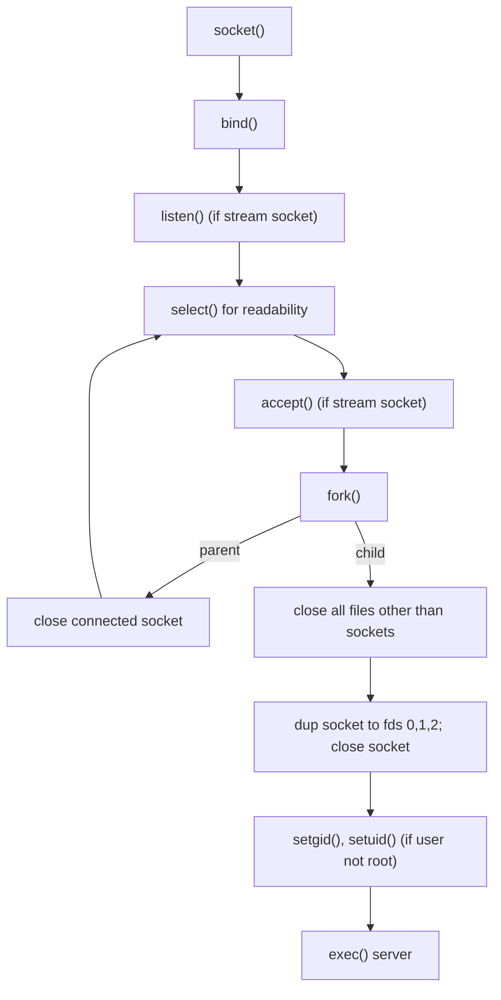
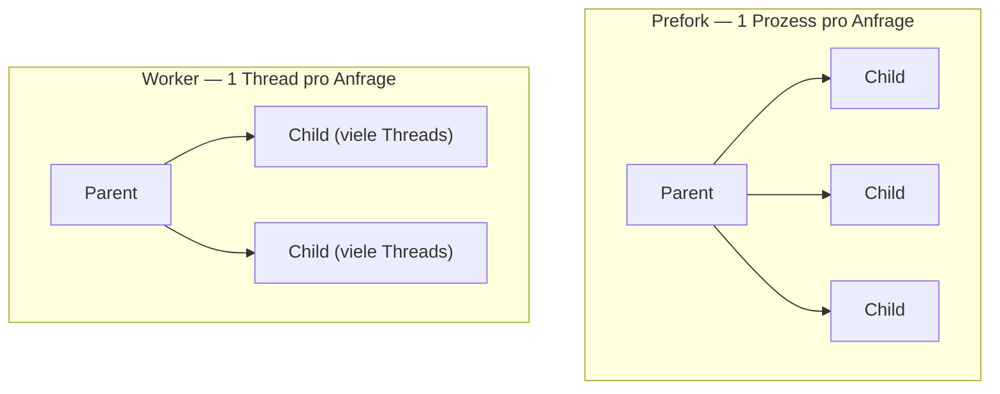
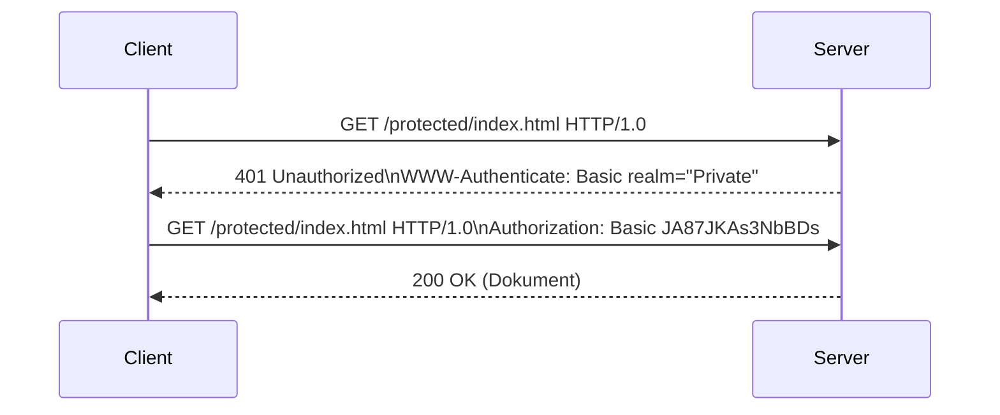
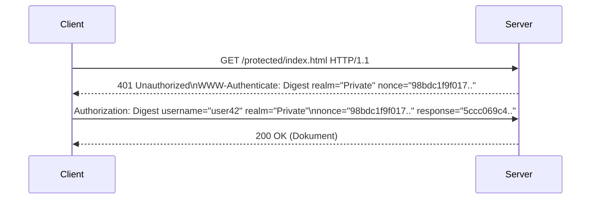
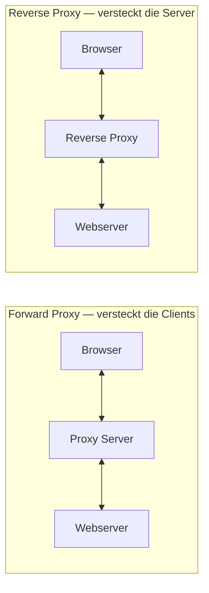
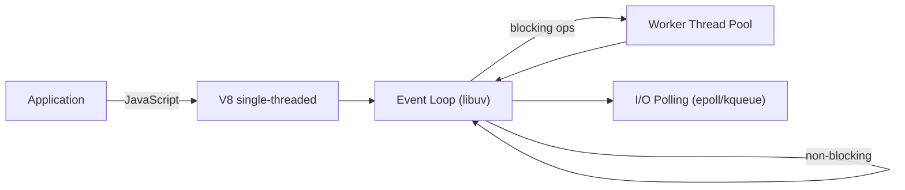
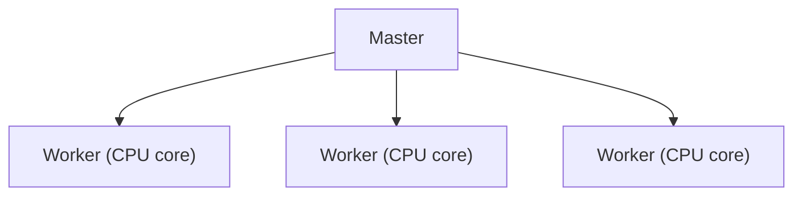
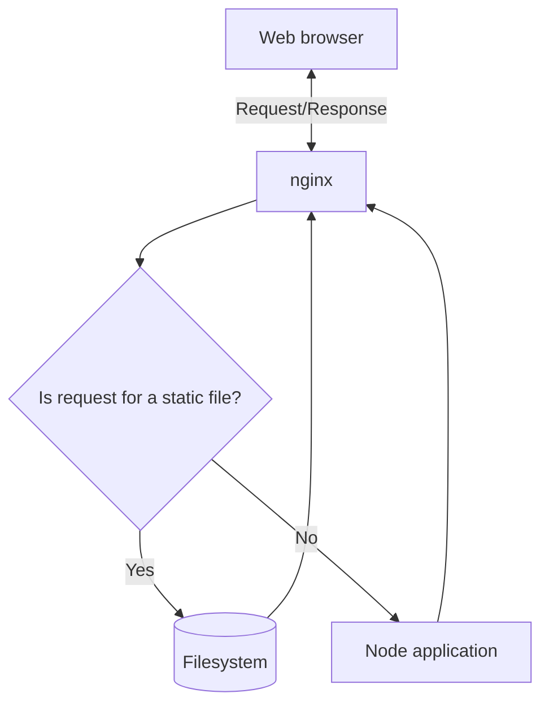

# 14 — Webserver (Apache, nginx, Node.js)

**Folien:** [[web-engineering/resources/14-Server.pdf|14-Server.pdf]]
**Lernziele:** [[web-engineering/lernziele/webeng-lernziele-09|Lernziele Vorlesung 9]]

## Inhaltsverzeichnis

- [[#inetd — der klassische Internet-Superdaemon|inetd — der klassische Internet-Superdaemon]]
- [[#Apache: Multi Processing Modules (MPM)|Apache: Multi Processing Modules (MPM)]]
- [[#CGI und FastCGI|CGI und FastCGI]]
- [[#Apache: Konfiguration|Apache: Konfiguration]]
- [[#Zugriffskontrolle: Authentifizierung|Zugriffskontrolle: Authentifizierung]]
- [[#nginx|nginx]]
- [[#Forward Proxy vs. Reverse Proxy|Forward Proxy vs. Reverse Proxy]]
- [[#Node.js: Wirklich single-threaded?|Node.js: Wirklich single-threaded?]]
- [[#Node.js: Worker-Thread-Modul|Node.js: Worker-Thread-Modul]]
- [[#Node.js: Cluster-Modul|Node.js: Cluster-Modul]]
- [[#Node.js und nginx kombiniert|Node.js und nginx kombiniert]]
- [[#Bezug zu Lernzielen|Bezug zu Lernzielen]]

---

## inetd — der klassische Internet-Superdaemon

> [!quote] Definition (Internet-Superdaemon)
> Der **inetd** ("Internet Service Daemon") ist ein **Master-Server**, der auf Anfragen wartet und pro eingehender Verbindung einen **Child-Prozess** erzeugt, der die Anfrage behandelt. Er ist die klassische Master-Server-Implementierung.

**Ablauf (Master-Server-Modell):**



- Der Master-Server **wartet** auf eine Anfrage, **akzeptiert** die Verbindung, **erzeugt einen Child-Prozess** und übergibt diesem die Verbindung. Der Child behandelt die Anfrage.
- Mit `dup` wird der **Socket-Deskriptor auf 0, 1, 2** (stdin/stdout/stderr) kopiert — der exec'te Server kommuniziert dann einfach über Standard-I/O.
- **Ergebnis:** Pro Anfrage entsteht ein eigener (Child-)Server-Prozess; jeder Server muss seine Initialisierung selbst vornehmen.

> [!info] Hinweis
> Heutige Linux-Systeme verwenden den allgemeineren **systemd**-Prozess für diese Aufgabe.

> [!warning] Achtung — warum inetd für HTTP wenig effektiv ist
> Multiprocessing lohnt, wenn Aufgaben **langfristiger Natur** sind und der Client einen Verbindungsstatus verwaltet. **HTTP ist aber zustandslos** → für jede HTTP-Verbindung einen neuen Prozess zu erzeugen ist **teuer**, und das Forken **blockiert** den Master-Server währenddessen.

---

## Apache: Multi Processing Modules (MPM)

> [!tip] Merke
> **Multi Processing Modules (MPM)** bestimmen, **wie** der Apache-Server eingehende Anfragen abarbeitet. Apache kommt standardmäßig mit zwei Modellen: **Prefork** und **Worker**.



### Prefork-Modell

- **Forking findet vor der Anfrage statt** ("Pre-Forking"). Prozesse "warten" darauf, genutzt zu werden; jeder Prozess behandelt **jeweils eine** Verbindung.
- Nachteile: **RAM-intensiv** und schlechte **Elastizität** — *"You'll run out of memory before CPU."*
- Beruht auf dem **Leader-Followers-Pattern** mit drei Rollen: **Listener** (wartet auf Anfragen = Leader), **Worker** (verarbeitet Anfragen), **Idle-Worker** (reiht sich in die Warteschlange ein, um die nächste Aufgabe zu übernehmen).

```apache
<IfModule mpm_prefork_module>
    StartServers           5   # Anzahl initial gestarteter Prozesse
    MinSpareServers        5   # min. lastfreie Prozesse
    MaxSpareServers       10   # max. lastfreie Prozesse
    MaxRequestWorkers    150   # = altes MaxClients: max. Prozesse
    MaxConnectionsPerChild 0
</IfModule>
```

### (Multithreaded-)Worker-Modell

- **Nur wenige** Child-Prozesse; jeder Child behandelt **viele Verbindungen gleichzeitig** — **ein Thread pro Verbindung** ("10s of threads").
- Nachteile: Die verarbeitende **Library muss multithreading-fähig** sein (Sicherheit!). Ein außer Kontrolle geratener Thread kann den **gesamten Prozess** beenden.

```apache
<IfModule mpm_worker_module>
    ServerLimit          16
    StartServers          2
    MinSpareThreads      25
    MaxSpareThreads      75
    ThreadLimit          64
    ThreadsPerChild      25
    MaxRequestWorkers   400
    MaxConnectionsPerChild 0
</IfModule>
```

> [!warning] Achtung — Prefork vs. Worker bei PHP
> Standard für Apache ist **Prefork**. Worker wäre wegen geringerem RAM-Bedarf zu präferieren, ist aber **nur möglich, wenn das verwendete Modul thread-safe** ist. Aus der PHP-Installation-FAQ: ein threaded MPM führt bei `mod_php` zu zusätzlichen Schwächen, weil die Threads keine separaten Speichersegmente / Sandboxes haben. **Fazit: PHP sollte nur im Prefork-Modus betrieben werden — oder via FastCGI** (eigener Speicherbereich).

---

## CGI und FastCGI

> [!quote] Definition (CGI — Common Gateway Interface)
> Eine **Datenschnittstelle zum Ausführen beliebiger externer Programme**. Eine spezifische URL signalisiert, dass mit dem GET/POST auf diese URL ein **externer Prozess** zu starten ist. Ursprünglich meist ein **Perl-Programm**: Der Interpreter wird in einem externen Prozess gestartet und erzeugt die HTML-Ausgabe.


> [!quote] Definition (FastCGI)
> Ähnlich dem Worker-Modell: Es gibt einen **Pool an CGI-fähigen Prozessen**, die **isoliert vom Web-Server** laufen (verbesserte Security — **Kundenisolation**). **Kein neuer Prozess pro Aufruf → höhere Performance.**

- Ein FastCGI-Prozess ist **threaded** → bedient mehrere Clients.
- **Sprachenunabhängig** (häufig C++-Programme). Funktioniert **nicht mit `.htaccess`**.
- Nutzt **Socket-basierte Kommunikation** über ein binäres Protokoll → kann **Verteilung (Scale-Out)** stützen.

| | CGI | FastCGI |
|---|---|---|
| Prozess pro Aufruf | ja (neu) | nein (Pool) |
| Performance | niedrig | hoch |
| Isolation | Prozess | Prozess-Pool, isoliert vom Server |
| Verteilung | nein | ja (Socket/binär) |

---

## Apache: Konfiguration

**Beispiel `httpd.conf`:**

```apache
ServerRoot "C:/xampp/apache"
Listen 80

# Funktionalitäten laden
LoadModule alias_module      modules/mod_alias.so
LoadModule autoindex_module  modules/mod_autoindex.so
LoadModule auth_basic_module modules/mod_auth_basic.so
LoadModule dir_module        modules/mod_dir.so
LoadModule ssl_module        modules/mod_ssl.so
LoadModule php_module        modules/libphp.so

ServerName localhost:80

<Directory />
    AllowOverride None    # .htaccess darf das nicht überschreiben
    Require all denied    # jeglicher Zugriff auf / wird blockiert
</Directory>

DocumentRoot "C:/xampp/htdocs"
<Directory "C:/xampp/htdocs">
    Options +Indexes      # Verzeichnis ohne index.html ausliefern
    AllowOverride All     # eigene Regeln über .htaccess
    Require all granted   # alle dürfen zugreifen
</Directory>

<IfModule dir_module>
    DirectoryIndex index.php index.html index.htm
</IfModule>

<Files ".ht*">
    Require all denied    # .ht*-Dateien sollten nicht lesbar sein
</Files>

ErrorLog "logs/error.log"
LogLevel warn
```

### Zugriffskontrolle

> [!info] Hinweis — alte vs. neue Syntax
> Vor Apache 2.4: `Order Deny,Allow` / `Order Allow,Deny`. Seit **Apache 2.4** einfacher über **`Require`**.

- **`Order Deny,Allow`**: Erst alle `Deny` auswerten; bei Treffer **abgelehnt**, *außer* es matcht auch ein `Allow`. Was keiner Regel entspricht, ist **erlaubt**.
- **`Order Allow,Deny`**: Erst alle `Allow` auswerten (mind. einer muss matchen). Dann `Deny`. Was keiner Regel entspricht, wird **standardmäßig abgelehnt**.

```apache
Require host fh-aachen.de
Require ip 149.201.122.100

<RequireAll>
    Require all granted
    Require not ip 192.168.205
    Require not host phishers.example.com
</RequireAll>
```

> [!success] Best Practice
> **Deny by default, allow explicitly** — standardmäßig alles verbieten und Zugriff nur explizit gewähren.

### .htaccess

- Erlaubt es, **Direktiven innerhalb von Verzeichnissen zu überschreiben, ohne den Server neu zu starten**.
- Häufig genutzt, um den **Zugriff zu beschränken** (z.B. auf das Intranet oder bestimmte IP-Adressen).
- Damit `.htaccess` wirkt, muss mindestens ein Elternverzeichnis per `Directory`-Direktive auf **`AllowOverride All`** stehen.
- Bildet auch die Basis für die **HTTP-basierte Authentifizierung**.

---

## Zugriffskontrolle: Authentifizierung

> [!warning] Achtung
> **HTTP bietet kein eigenes Konzept zur Datensicherheit.** Die Absicherung der Übertragung geschieht durch **HTTPS (HTTP über TLS/SSL)**. Zur Einschränkung des Zugriffs durch **Authentifizierung des Clients** stellt HTTP zwei Verfahren bereit: **Basic** und **Digest Authentication**.

### Basic Authentication

- Authentifizierungsmethode seit **HTTP 1.0**. Übertragung von Benutzerkennung und Passwort; das Passwort **kann sogar unverschlüsselt** sein. Autorisierung basiert auf einer passwd-ähnlichen Datei (`crypt`).



```apache
# .htaccess im zu schützenden Verzeichnis
AuthUserFile c:\xampp\htdocs\protected\.htpasswd
AuthType Basic
AuthName "Der Zugriff ist geschützt"
require valid-user
# Nutzer anlegen:  htpasswd -d -c c:\xampp\htdocs\protected\.htpasswd user
```

> [!warning] Achtung — Probleme von Basic Auth
> - Passwörter werden im **Klartext** (Benutzername:Password in **Base64**) übermittelt → leicht **abzufangen** (Abhilfe: HTTPS).
> - **Keinerlei Authentisierung des Servers** → offen für **Spoofing** (Abhilfe: HTTPS).
> - **Keine Absicherung der Nachrichten** → **Man-in-the-Middle** (Abhilfe: HTTPS).
> - Browser **cached** Username + Password (vergleichbar mit einem Password-Cookie).

### Digest Authentication

- Verbesserung in **HTTP 1.1**: Der Server überträgt eine **zufällige Zeichenkette (Challenge / `nonce`)**. Der Benutzer erzeugt mit seinem Kennwort daraus eine **Signatur (Digest)**. Der Server kennt das korrekte Kennwort und prüft die Gültigkeit.



```apache
# httpd.conf:  LoadModule auth_digest_module modules/mod_auth_digest.so
# .htaccess:
AuthDigestFile c:\apachefriends\xampp\htdocs\.htpasswd.di
AuthType Digest
AuthName "Vorlesung"
require valid-user
# Nutzer anlegen:  htdigest -c ...\.htpasswd.di Vorlesung user
```

> [!tip] Merke — Vorteile von Digest gegenüber Basic
> - **Keine Passwörter im Klartext / einfacher Base64-Kodierung.**
> - **Keine Klartextpasswörter** auf dem Server.
> - Der **Server wird authentisiert**.
> - Ansonsten wird aber **nicht viel gewonnen**: Man-in-the-Middle- und Sniffing-Attacken bleiben möglich → echte Absicherung nur mit HTTPS.

---

## nginx

> [!quote] Definition (nginx, "engine-ex")
> Der von **Igor Sysoev** ursprünglich für eine russische Suchmaschine entwickelte Webserver mit besonderen Eigenschaften: **hohe Performance**, **geringer Memory-Footprint**, **Reverse Proxy**, **E-Mail Proxy**, **erweiterbar durch Module**.

- Vorteile für einfache Webserver mit seltenen Anpassungen und für **Infrastruktur mit eingeschränkter Hardware (Embedded Systems)**.
- Zusammen mit dem **Memcached-Key-Value-Store-Modul** ergibt sich ein sehr leistungsfähiges System.

---

## Forward Proxy vs. Reverse Proxy



> [!quote] Definition (Forward Proxy)
> Ein Server, **hinter dem sich die Clients "verstecken"**. Aus Sicht des Webservers **ist der Proxy der Client**.
> Anwendungen: Anonymisierung, Firewall, **TLS-Terminierung** (keine Verschlüsselung im internen Netz), SSL Visibility Appliance, Werbefilter, Caching.

> [!quote] Definition (Reverse Proxy)
> Ein Server, **hinter dem sich andere Server "verstecken"**. Der Client **sieht nur den Reverse Proxy**.
> Anwendungen: **Sicherheit/Firewall**, Verschlüsselung über den Reverse Proxy, **Load Balancing** (mehrere Server hinter dem Proxy), Caching/Content Delivery, Authentifizierung.

**nginx als Reverse Proxy / Load Balancer:**

```nginx
http {
    upstream backend {
        server backend1.example.com;
        server backend2.example.com;
        server backend3.example.com;
    }
    server {
        listen 80;
        server_name example.com;
        location / {
            proxy_pass http://backend;
            proxy_set_header Host $host;
        }
    }
}
```

---

## Node.js: Wirklich single-threaded?

> [!tip] Merke
> **Tatsächlich ist Node.js nicht wirklich single-threaded.** Die **JavaScript-Laufzeitumgebung (V8-Engine) ist single-threaded** und nutzt die **Event-Queue/Loop**. Die asynchron durchzuführende Arbeit wird aber über **libuv** (realisiert u.a. die Event-Loop) an einen **Worker-Thread-Pool** weitergeleitet.



- Basis der Event-Loop ist **»Event Poll«** (`epoll` auf Linux) bzw. **`kqueue`** (BSD). Daraus folgt die Regel: **»Do not block the event-loop!«**
- Einige Aufgaben (I/O, CPU-intensiv) werden in **libuv** realisiert und können auf andere Threads ausgelagert werden — ebenso gibt es **threaded Funktionen** (z.B. aus dem Package `crypto`).
- Die eigentliche Idee von **libuv**: über Event-Loops den **I/O asynchron** durchführen. **TCP, UDP und DNS** gehören dazu. libuv hat hierzu einen **Thread-Pool**.

> [!info] Hinweis — Thread-Pool-Größe
> Node.js nutzt standardmäßig einen Pool aus **4 Threads** (früher) bzw. **so viele wie es Kerne gibt** (aktuell). Über die Umgebungsvariable lässt sich das anpassen:
> `UV_THREADPOOL_SIZE=100 && node index.js` → 100 Threads.

---

## Node.js: Worker-Thread-Modul

> [!tip] Merke
> **Seit Version 10.5: `worker_threads` als Core-Modul.** JavaScript selbst wird **nicht** multi-threaded — aber wir **duplizieren die V8-Engine & Event-Loop** für viele Threads und haben so **mehrere Node-Instanzen in einem Prozess**.

```js
// main.mjs
import { Worker } from 'worker_threads';
console.log("Main thread started...");
const worker = new Worker("./worker.mjs");        // Code für eigenen Thread
worker.on('message', (msg) => console.log(`Worker: ${msg}`)); // Kommunikationskanal vom Worker
worker.on('error', (err) => console.error(`Worker error: ${err}`));
worker.on('exit', (code) => {
  if (code !== 0) console.error(`Worker stopped with exit code ${code}`);
  else console.log('Worker finished successfully.');
});
console.log("Doing work in main thread...");
```

```js
// worker.mjs
import { isMainThread, parentPort } from 'worker_threads';
if (!isMainThread) {
  parentPort.postMessage("Hello from worker thread");  // Kommunikationskanal zum Main thread
  cpuIntensiveTask(1000);
  parentPort.postMessage("I am working");
  cpuIntensiveTask(1000);
  parentPort.postMessage("Task is done");
}
function cpuIntensiveTask(timeInMilliSecond) {
  const end = Date.now() + timeInMilliSecond;
  while (Date.now() < end) {}
}
```

Ausgabe:

```
Main thread started...
Doing work in main thread...
Worker: Hello from worker thread
Worker: I am working
Worker: Task is done
```

---

## Node.js: Cluster-Modul

> [!quote] Definition (Cluster-Modul)
> Mittels des **Cluster-Moduls** kann man **adressraumtechnisch getrennte Instanzen** starten. Die Kommunikation geschieht über **Interprozesskommunikation (IPC)**.



```js
import express from 'express';
import cluster from 'cluster';
import { cpus } from 'os';
const port = 3001;

if (cluster.isPrimary) {
  for (var i = 0; i < cpus().length; i++) {
    cluster.fork();                  // Create worker
  }
} else {
  // Workers share the TCP connection in this server
  const app = express();
  app.get('/', (req, res) => res.send("Hello World!"));
  app.listen(port, () => console.log("Listening on http://localhost:" + port));
}
```

> [!info] Hinweis — Lastverteilung & Port-Sharing
> Im Cluster-Modul steckt ein **eingebetteter Load-Balancer**. Auf Linux/OSX (nicht Windows) gilt standardmäßig die **Round-Robin-Policy** (`cluster.SCHED_RR`); die einzige Alternative `cluster.SCHED_NONE` überlässt es dem OS (Default unter Windows). Steuerbar über `cluster.schedulingPolicy` oder `NODE_CLUSTER_SCHED_POLICY` (`'rr'` / `'none'`). Das **Port-Sharing** übernimmt cluster via **IPC** — der Master reicht das Port-Handle an jeden Worker.

---

## Node.js und nginx kombiniert

> [!success] Best Practice — Win-Win: Statisches via nginx
> nginx als **Proxy** vorschalten: Ist die Anfrage ein **statisches File**, liefert nginx es direkt aus dem **Filesystem** (schnell). Andernfalls reicht nginx die Anfrage an die **Node-Application** weiter. So entlastet man Node von statischen Assets.



---

## Bezug zu Lernzielen

Die kompakten Karteikarten finden sich unter [[web-engineering/lernziele/webeng-lernziele-09|Lernziele Vorlesung 9]].

**Was sollten Sie über den Internet-Superdaemon und Apache MultiProcessingModules wissen?**

Der **Internet-Superdaemon (inetd)** ist die klassische **Master-Server-Implementierung**: Er wartet auf Anfragen (`socket → bind → listen → select → accept`), und erzeugt pro Verbindung per **`fork()`** einen Child-Prozess, der die Anfrage behandelt (Socket-Deskriptor wird per `dup` auf fds 0/1/2 gelegt). Pro Anfrage entsteht also **ein eigener Prozess** — für zustandsloses HTTP ineffektiv (teuer, Master blockiert beim Forken). Apaches **MPMs** bestimmen die Abarbeitung:

- **Prefork:** ein **Prozess pro Anfrage** (Pre-Forking, Leader-Followers-Pattern), saubere Trennung, aber RAM-intensiv.
- **Worker:** ein **Thread pro Verbindung**, wenige Prozesse mit vielen Threads, ressourcenschonend, erfordert aber **thread-safe** Module.

**Was sollten Sie über CGI und FASTCGI wissen?**

**CGI** ist eine Schnittstelle zum Ausführen **externer Programme** (ursprünglich Perl): Pro Aufruf wird ein **neuer Prozess** gestartet, der HTML erzeugt → **teuer & langsam**. **FastCGI** hält stattdessen einen **Pool isolierter, threaded CGI-Prozesse** (Kundenisolation), startet **keinen neuen Prozess pro Aufruf** → höhere Performance, ist sprachunabhängig und nutzt **Socket-basierte Kommunikation** (binär) → Scale-Out möglich. FastCGI funktioniert nicht mit `.htaccess`. PHP läuft deshalb idealerweise **Prefork oder via FastCGI**.

**Was sollten Sie über Reverse-Proxy wissen?**

Ein **Reverse Proxy** ist ein Server, **hinter dem sich andere Server verstecken** — der Client sieht nur den Proxy. Im Gegensatz dazu versteckt ein **Forward Proxy** die Clients (aus Server-Sicht ist der Proxy der Client). Einsatzzwecke des Reverse Proxy: **Sicherheit/Firewall**, **TLS-Verschlüsselung** am Proxy, **Load Balancing** (mehrere Backends, z.B. nginx `upstream`), **Caching/Content Delivery** und **Authentifizierung**.

**Was sollten Sie über BASIC und DIGEST-Authentication wissen?**

**Basic Authentication** (seit HTTP 1.0): Server antwortet mit **401 + `WWW-Authenticate: Basic`**, Client sendet `Authorization: Basic <Base64(user:pw)>`. Das Passwort wird nur **Base64-kodiert** (≈ Klartext) übertragen → abfangbar, kein Server-Auth, kein MitM-Schutz (Abhilfe jeweils HTTPS). **Digest Authentication** (HTTP 1.1): Server sendet eine **Challenge (`nonce`)**, der Client bildet daraus mit dem Kennwort eine **Signatur (Digest)** → keine Klartextpasswörter (auch nicht auf dem Server gespeichert), **Server wird authentisiert** — bietet aber gegen MitM/Sniffing nur begrenzt mehr Sicherheit. Konfiguriert via `.htaccess` (`AuthType Basic/Digest`, `htpasswd`/`htdigest`), setzt `AllowOverride All` voraus.

**Was sollten Sie über node.js und Threading wissen?**

Node.js ist **nicht wirklich single-threaded**: Die **V8-Engine** (JS-Ausführung) ist single-threaded mit **Event-Loop**, aber **libuv** lagert asynchrone/blockierende Arbeit (I/O, TCP/UDP/DNS, `crypto`) an einen **Worker-Thread-Pool** aus (Größe ≈ Kernanzahl, via `UV_THREADPOOL_SIZE` steuerbar). Regel: **»Do not block the event-loop«**. Für echte Parallelität gibt es zwei Module: **`worker_threads`** (seit 10.5) dupliziert V8 & Event-Loop → mehrere Node-Instanzen in **einem Prozess**, Kommunikation per `postMessage`; das **`cluster`-Modul** startet **adressraumgetrennte** Prozesse (IPC, eingebetteter Round-Robin-Load-Balancer, Port-Sharing) — ideal, um alle CPU-Kerne zu nutzen.
