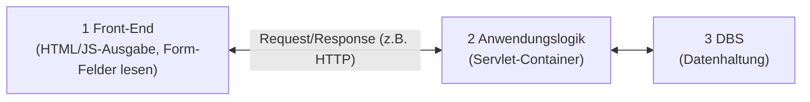
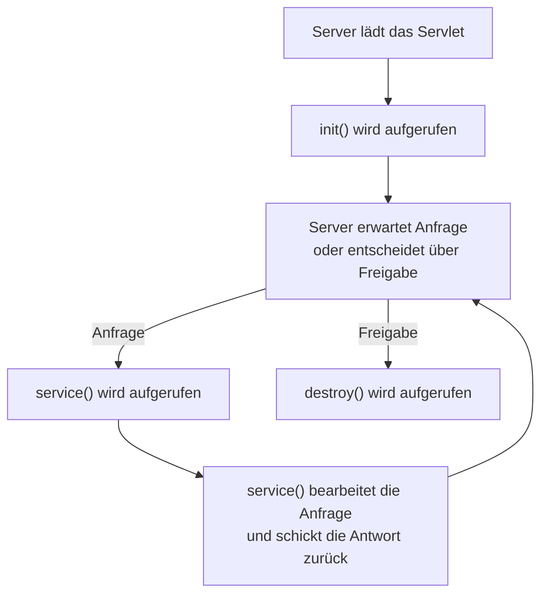
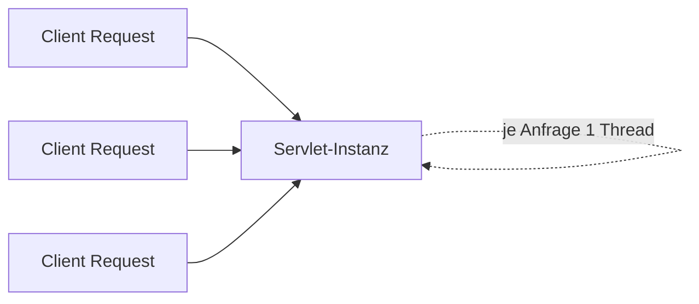
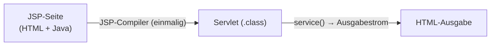
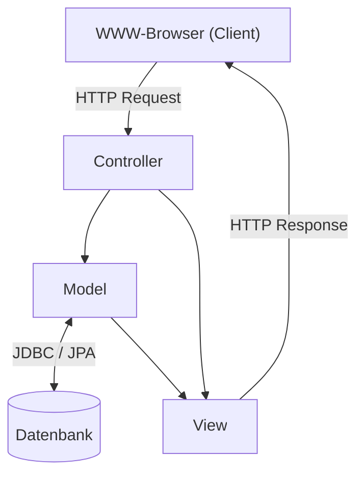

# 15 — Java: Servlets & Java Server Pages (JSP)

**Folien:** [[web-engineering/resources/15-Java.pdf|15-Java.pdf]]
**Lernziele:** [[web-engineering/lernziele/webeng-lernziele-10|Lernziele Vorlesung 10]]

## Inhaltsverzeichnis

- [[#Server-API-Ansätze|Server-API-Ansätze]]
- [[#Was ist ein Servlet?|Was ist ein Servlet?]]
- [[#Vergleich der serverseitigen Konzepte|Vergleich der serverseitigen Konzepte]]
- [[#Servlet-Lebenszyklus|Servlet-Lebenszyklus]]
- [[#Servlet-API: init, service, destroy|Servlet-API: init, service, destroy]]
- [[#Threads im Servlet-Container|Threads im Servlet-Container]]
- [[#HelloWorld-Servlet|HelloWorld-Servlet]]
- [[#Annotationen (Servlets 3.0)|Annotationen (Servlets 3.0)]]
- [[#Parameter, Cookies und Sessions|Parameter, Cookies und Sessions]]
- [[#Bewertung von Servlets|Bewertung von Servlets]]
- [[#Apache Tomcat|Apache Tomcat]]
- [[#Java Server Pages (JSP)|Java Server Pages (JSP)]]
- [[#Model View Controller (MVC)|Model View Controller (MVC)]]
- [[#Enterprise Java Beans & Spring|Enterprise Java Beans & Spring]]
- [[#Bezug zu Lernzielen|Bezug zu Lernzielen]]

---

## Server-API-Ansätze

> [!quote] Definition (Server-API / ausführbare Programmeinheiten)
> Ausführbare Programmeinheiten im Web-Server, entwickelt, um die **Nachteile von CGI / Server-Side-Scripting zu überwinden**. Die Anweisungen stehen **nicht als Skript-Anweisungen in einer HTML-Datei**, sondern bilden eine **eigenständige Anwendung**. Das übersetzte Programm wird über eine definierte Schnittstelle (**Container**) im Server zur Laufzeit eingebunden.

- Benötigen einen **speziellen Server**, der den Container bereitstellt.
- Erweiterungen werden in den **Adressraum des Servers** geladen: **nur einmal geladen**, **in Threads statt Prozessen** ausgeführt.
- Bekannteste Vertreter: **ASP.NET** (Microsoft), **Java Servlets** (Oracle).

---

## Was ist ein Servlet?

> [!quote] Definition (Servlet)
> Eine **abgeleitete Java-Klasse**, die von einem **Container** (Web- oder Application-Server) verwaltet wird und **dynamische HTML-Inhalte** (oder anderes) generiert.

> [!tip] Merke
> Ein Servlet besitzt **keine `main`-Methode** — sein Lebenszyklus wird vom Container gesteuert.

**Servlet-Engine (Container = unser Web-Server):**

- Enthält und verwaltet die Servlets über ihren **gesamten Lebenszyklus**.
- Bindet die Servlets über **feste vorgegebene Interfaces** ein.
- Stellt die Dienste zum **Empfangen von Anfragen und Senden von Antworten** bereit.
- Bildet die **Kommunikationsendpunkte** für die Servlets, die über die **http-URL** angesprochen werden.

**Programmtechnische Nutzung durch die Servlet-API:**

- Teil des SDK der **Jakarta Enterprise Edition (JEE)**.
- `javax.servlet`: protokoll-**unabhängige** Klassen und Interfaces.
- `javax.servlet.http`: http-**spezifische** Erweiterungen.
- Steuerungsmöglichkeiten durch **Annotationen**.

**Ablauf einer HTTP-Anfrage (3-Tier-Architektur):**



---

## Vergleich der serverseitigen Konzepte

| Konzept | Prozessmodell | Charakteristik |
|---|---|---|
| **CGI** | jede Anfrage erzeugt einen **eigenen Prozess** | Schnittstelle zum Ausführen externer Programme; **sprach-/systemunabhängig** |
| **PHP** | jede Anfrage besitzt **eine eigene Instanz** | aktive Anweisungen im HTML-Objekt, zur Laufzeit interpretiert; Session-Management-Funktionen |
| **Servlet** | **dauerhafte Instanz**, oft über Anfragen hinweg existent | in Java programmierter Webserver als "Heimat"; **mehrere Anfragen interagieren mit derselben Instanz** (Lebenszyklus vom Container verwaltet) |

---

## Servlet-Lebenszyklus

> [!tip] Merke — fünf Phasen
> Ein Servlet unterliegt einem genau festgelegten Lebenszyklus, realisiert über die Methoden **`init`**, **`service`** und **`destroy`** (überladbar):



1. **Laden** der Servlet-Klasse und Instanziieren (on demand)
2. **Initialisieren** des Servlet-Objekts
3. **Verarbeitung** der verschiedenen Anforderungen
4. **Entfernen** des Servlet-Objekts
5. **Entladen** der Servlet-Klasse

Bei Anfragen prüft der Server, ob neuere Versionen des `*.class`-Files vorhanden sind, und lädt diese ggf. **neu**.

---

## Servlet-API: init, service, destroy

**Laden & Instanziieren** — beim Start des Containers **oder** beim Empfang der ersten Anfrage. Hängt von der Konfiguration ab (`web.xml` oder Annotation): bei `<load-on-startup>1</load-on-startup>` wird das Servlet schon beim Container-Start instanziiert.

`init()` übernimmt **globale Initialisierungsaufgaben**: Datenbank-/Netzwerkverbindung herstellen, Konfigurationsdatei einlesen, einen Thread starten.

**Client-Anfragen bearbeiten:**

- Über das Überladen der **generischen `service`-Methode** (nicht an HTTP gebunden) — Zugriff auf `ServletRequest`, Antwort über `ServletResponse`.
- Implementiert man `service` nicht, leitet man bei einem **HTTP-Servlet** die spezifischen Methoden **`doGet`** und **`doPost`** ab — mit Zugriff auf **`HttpServletRequest`** und **`HttpServletResponse`**. Das ist die **gebräuchliche Form**.

**Entladen:** Der Container entscheidet, wann die Instanz aus dem Speicher entfernt wird; vorher wird **`destroy`** aufgerufen.

```java
import javax.servlet.*;
import javax.servlet.http.*;
public class TemplateServlet extends HttpServlet {
    public void init() {
        // Wird bei Erstellung des Servlets aufgerufen
    }
    public void doGet(HttpServletRequest request, HttpServletResponse response)
            throws IOException, ServletException {
        // Abarbeitung einer Get-Anfrage
    }
    public void doPost(HttpServletRequest request, HttpServletResponse response)
            throws IOException, ServletException {
        // Abarbeitung einer Post-Anfrage
    }
    public void destroy() {
        // Wird bei Beendigung des Servlets aufgerufen
    }
}
```

---

## Threads im Servlet-Container

> [!warning] Achtung — Thread-Safe Programmierung ist ein Muss!
> Verschiedene Klienten können Anfragen **zur selben Servlet-Instanz** verschicken. Hierzu wird für **jede Anfrage ein eigenständiger Thread** verwendet. Da alle Threads auf derselben Instanz arbeiten, müssen Instanzvariablen thread-safe behandelt werden.



> [!tip] Merke
> Servlets nutzen i.allg. eher **Klassenvariablen** und verwenden **Instanzvariablen nur zu Hilfszwecken** — wegen der gemeinsam genutzten Instanz.

---

## HelloWorld-Servlet

```java
import java.io.*;
import javax.servlet.*;
import javax.servlet.http.*;

public class HelloWorld extends HttpServlet {
    public void doGet(HttpServletRequest request, HttpServletResponse response)
            throws IOException, ServletException {
        response.setContentType("text/html");
        PrintWriter out = response.getWriter();
        Date d = new Date();
        out.println(
            "<html>\n" +
            "<head>\n" +
            "<title>Hello World</title>\n" +
            "</head>\n" +
            "<body>\n" +
            "<h1>Hello World</h1>\n" +
            "Wir haben heute den " + d.toString() +
            "</body>\n" +
            "</html>\n"
        );
        out.close();   // Sende das HTML-Dokument
    }
}
```

---

## Annotationen (Servlets 3.0)

> [!info] Hinweis
> Mit der **Servlets 3.0-API** wurden Annotationen eingeführt: `@HandlesTypes`, `@HttpConstraint`, `@HttpMethodConstraint`, `@MultipartConfig`, `@ServletSecurity`, `@WebFilter`, `@WebInitParam`, `@WebListener`, `@WebServlet`. Sie helfen dem Container, das Servlet **passend (URL) einzubinden** und Funktionalitäten zu erkennen.

**`@WebServlet`** — zeichnet die Klasse als Servlet aus und erlaubt z.B. die Vergabe eines Namens; die Klasse muss trotzdem von `javax.servlet.http.HttpServlet` abgeleitet sein:

```java
@WebServlet(
    description = "A sample annotated servlet",
    urlPatterns = {"/QuickServlet"}
)
// Kurz: @WebServlet("/QuickServlet")
public class MyServlet extends HttpServlet { /* ... */ }
```

Man kann auch **mehrere Routen** angeben; die `do`*Verb*-Methode reagiert dann auf die entsprechende HTTP-Operation.

**`@WebFilter`** — ermöglicht eine **Vorverarbeitung** der Anfragen (z.B. nur authentifizierte/autorisierte Anfragen). **Ähnlich Middlewares.** `doFilter` wird bei jedem annotierten Aufruf durchgeführt:

```java
@WebFilter(filterName = "myFilter", urlPatterns = "/myservlet")
public class MyFilter implements Filter {
    @Override public void init(FilterConfig filterConfig) throws ServletException {}
    @Override public void doFilter(ServletRequest request, ServletResponse response, FilterChain chain)
            throws IOException, ServletException {}
    @Override public void destroy() {}
}
```

---

## Parameter, Cookies und Sessions

**Parameter** — der Zugriff wird über das **`request`-Objekt** vereinfacht: `request.getPathInfo()`, `request.getRemoteHost()`, `request.getQueryString()`, `request.getParameter("paramName")`.

**Cookies:**

```java
Cookie myCookie = new Cookie("name", "value");
response.addCookie(myCookie);
```

**Sessions (`HttpSession`-Objekt)** — mit `getSession()` die aktuelle Session holen bzw. neu anlegen; mit `setAttribute` **jederzeit** eigene Key-Value-Paare setzen:

```java
HttpSession session = request.getSession();
Integer count = new Integer(1);
session.setAttribute("counter", count);

HttpSession session2 = request.getSession(false);   // keine neue anlegen
if (session2 != null) {
    Integer count2 = (Integer) session2.getAttribute("counter");
    Enumeration e = session2.getAttributeNames();
    while (e.hasMoreElements()) {
        String name = (String) e.nextElement();
        // ... session2.getAttribute(name)
    }
}
```

> [!tip] Merke — typischer Servlet-Ablauf (Zusammenfassung)
> 1. Klasse `HttpServlet` erweitern, Annotationen nutzen.
> 2. `doGet(...)` und/oder `doPost`-Methode überschreiben (`service()` als Alternative).
> 3. Benutzerparameter mit `HttpServletRequest` einlesen (`getParameter("…")`).
> 4. Antwort mit `HttpServletResponse` erstellen: Content-Type setzen → `PrintWriter` holen → HTML senden → ggf. Header/Cookies setzen.

---

## Bewertung von Servlets

> [!success] Vorteile
> - **Flexible Anbindung an die Java-Welt.**
> - **Threads reduzieren den Ressourcenverbrauch.**
> - Ergeben zusammen mit **Enterprise Java Beans** eine mächtige Entwicklungsbasis.

> [!warning] Nachteile
> - **Abhängig von den Fähigkeiten des http-Servers** (kein nativer Server).
> - Verwaltung der verschiedenen **Sitzungen muss implementiert** werden.
> - **Vermischung von Präsentations- und Anwendungslogik.**

Servlets eignen sich insbesondere für die Anbindung an **komplexe Standardanwendungen**. Die Anwendungslogik wird oft im **Beans Container** (JBoss/Tomcat) realisiert. Mit solchen Containern lassen sich auch **REST-konforme Lösungen über Annotationen** regeln, z.B. **JAX-RS**:

```java
@Path("/hello")
public class HelloService {
    @GET
    @Path("/{param}")
    public Response getMsg(@PathParam("param") String msg) {
        String output = "Jersey say : " + msg;
        return Response.status(200).entity(output).build();
    }
}
```

---

## Apache Tomcat

> [!quote] Definition (Apache Tomcat)
> Ein **Container für Servlets und Java Server Pages** — die **Open-Source-Referenzimplementierung** der Apache Software Foundation des Servlet-API, **vollständig in Java** geschrieben.

- Tomcat ist **kein Application-Server**, sondern ein eher **leichtgewichtiger Servlet-Container** und unterstützt z.B. **keine Enterprise Java Beans**.
- Tomcat alleine kann daher **kein JAX-RS**. Hierfür wäre eine Implementierung erforderlich, z.B. **Jersey**, die man in Tomcat als Servlet einbindet, das auf **alle Routen unterhalb** reagiert.

---

## Java Server Pages (JSP)

> [!quote] Definition (JSP)
> **Umkehrung des Servlet-Prinzips:** statt "Java-Code generiert HTML" sind **JSP-Seiten HTML-Seiten, die auch Java-Code beinhalten** — analog zu den Template-Mechanismen (und dem PHP-Prinzip). Abgrenzung der Anweisungen durch **spezielle Tags**.

> [!tip] Merke — JSP sind Servlets
> JSP-Seiten werden vom Server **automatisch in Servlets übersetzt**: Der Server unterscheidet JSP- von normalen HTML-Seiten, **kompiliert** mit einem JSP-Compiler die Code-Segmente und erstellt ein Servlet. Die HTML-Anweisungen werden beim Kompilationsschritt an den Ausgabestrom der `service`-Methode angehängt. Der **Übersetzungsvorgang muss nur einmal** getätigt werden — danach nutzt der Container direkt die übersetzte Klasse.



> [!success] Best Practice — Tag-Libraries
> Statt Java-Code direkt in die JSP zu schreiben, kapseln **Tag-Libraries (Taglibs)** Logik hinter **wiederverwendbaren, benannten Custom Tags** (HTML-ähnliche Syntax). Vorteile: **möglichst wenig Java-Code in der View**, saubere Trennung von Darstellung und Logik, bessere Lesbarkeit/Wartbarkeit und wiederverwendbare Bausteine — die View bleibt für Designer zugänglich.

---

## Model View Controller (MVC)

> [!quote] Definition (MVC)
> Trennung in drei Rollen: **Model** (Datenstruktur, speichert Daten, Methoden zur Änderung, realisiert manchmal die Geschäftslogik), **View** (Bildschirmrepräsentation, erhält Daten vom Model), **Controller** (Reaktion/Verarbeitung von Benutzereingaben, Vermittler zwischen Model und View, beinhaltet oftmals die Geschäftslogik).



**Implementierung im Servlet-Container:**

- **Model:** meist als **Java Beans** — enthalten die eigentliche Programmlogik, berechnen Ergebnisse, speichern Zustände, **unabhängig von der Webschnittstelle**.
- **View:** **JSP-Seiten**, Anzeige des Ergebnisses, Ziel: **möglichst wenig Java-Code**.
- **Controller:** ein **Servlet**, liest und prüft Parameter, ruft die Programmlogik im Model auf, gibt das Ergebnis an die passende View weiter (z.B. **Struts** mit generischem `ActionServlet`).

**Verwandte Muster:** Model-View-**Presenter** (MVP) und Model-View-**ViewModel** (MVVM) unterscheiden sich in der Anordnung und Kopplung von View und Vermittler.

---

## Enterprise Java Beans & Spring

> [!quote] Definition (Enterprise Java Beans, EJB)
> Standardisierte Komponenten innerhalb eines **Jakarta-EE-Servers**, die **serverseitige Operationen** ausführen (komplexe Algorithmen, hochtransaktionale Geschäftsoperationen). Der Application-Server liefert eine **hochverfügbare (7×24), fehlertolerante, transaktionale, mehrbenutzerfähige und sichere** Umgebung. Typische Aufgaben: **Geschäftslogik ausführen, auf Datenbank zugreifen, andere Systeme integrieren.** Sie vereinfachen die Entwicklung komplexer, mehrschichtiger verteilter Systeme.

**Das Spring Framework** bietet einen umfassenden Baukasten:

- **Core Container:** Beans, Core, Context, Expression Language.
- **Data Access / Integration:** JDBC, ORM, OXM, JMS, Transactions.
- **Web (MVC / Remoting):** Web, Servlet, Portlet, Struts.
- Quer dazu: **AOP**, Aspects, Instrumentation, Test.

---

## Bezug zu Lernzielen

Die kompakten Karteikarten finden sich unter [[web-engineering/lernziele/webeng-lernziele-10|Lernziele Vorlesung 10]].

**Wie kommen Servlets ohne main-Methode aus, und wie realisieren Sie eigene Logik über Servlets?**

Ein Servlet braucht **keine `main`-Methode**, weil sein gesamter Lebenszyklus vom **Container** (Servlet-Engine, z.B. Tomcat) gesteuert wird: Der Container lädt und instanziiert die Klasse und ruft die vorgegebenen Lifecycle-Methoden auf — `main` als Einstiegspunkt entfällt. **Eigene Logik** realisiert man, indem man von `HttpServlet` ableitet und die Methoden überschreibt:

- **`doGet` / `doPost`** (HTTP-spezifisch, mit `HttpServletRequest`/`HttpServletResponse`) bzw. generisch **`service`** (`ServletRequest`/`ServletResponse`).
- Eingaben werden über das **`request`-Objekt** gelesen (`getParameter("name")`, `getQueryString()`, …), die Antwort über das **`response`-Objekt** erzeugt (`setContentType` → `getWriter()` → HTML schreiben → ggf. Cookies/Header setzen).

**Wie setzen Sie Container und Lebenszyklus in Beziehung, und wieso spielen hier Annotationen eine Rolle?**

Der **Container** verwaltet das Servlet über seinen kompletten **Lebenszyklus**: Laden/Instanziieren (on demand oder beim Container-Start via `<load-on-startup>1`), **`init()`** für globale Initialisierung (DB-Verbindung, Konfiguration, Threads), mehrfaches **`service()` / `doGet` / `doPost`** zur Anfragebearbeitung — dabei **ein Thread pro Anfrage auf derselben Instanz** (Thread-Safety nötig) — und am Ende **`destroy()`** vor dem Entladen.

**Annotationen** (seit der **Servlets-3.0-API**) helfen dem Container, das Servlet passend einzubinden und Funktionalitäten zu erkennen — sie ersetzen Konfiguration in der `web.xml`. Beispiele: `@WebServlet("/route")` bindet die Klasse an eine URL (mehrere Routen möglich; `do`*Verb* reagiert auf die HTTP-Operation), `@WebFilter` realisiert eine **Vorverarbeitung** der Anfragen (Middleware-ähnlich, z.B. Authentifizierung).

**Können Sie die Idee von Java Server Pages und das Konzept der Tag-Libraries inkl. ihrer Vorteile erklären?**

**JSP** kehrt das Servlet-Prinzip um: Statt „Java erzeugt HTML" sind JSP **HTML-Seiten mit eingebettetem Java-Code** (spezielle Tags, analog zum PHP-/Template-Prinzip). Der Server erkennt JSP-Seiten, **kompiliert sie mit einem JSP-Compiler einmalig in ein Servlet** (die HTML-Teile landen im Ausgabestrom der `service`-Methode) und nutzt danach direkt die übersetzte Klasse.

**Tag-Libraries (Taglibs)** sind Sammlungen wiederverwendbarer, benannter **Custom Tags**, die Java-Logik hinter HTML-ähnlichen Tags kapseln. **Vorteile:** möglichst **wenig Java-Code in der View**, saubere Trennung von Darstellung und Logik, bessere Lesbarkeit/Wartbarkeit und wiederverwendbare Bausteine — die View bleibt auch für Designer zugänglich.

**Wie setzen Sie das MVC-Modell mit Servlets in Beziehung?**

Im Servlet-Container verteilen sich die MVC-Rollen klar:

- **Controller = Servlet** — liest und prüft die übergebenen Parameter, ruft die eigentliche Logik im Model auf und leitet das Ergebnis an die passende View weiter.
- **Model = Java Beans** — enthalten Programm-/Geschäftslogik, berechnen Ergebnisse und speichern Zustände, **unabhängig von der Webschnittstelle**.
- **View = JSP-Seiten** — Anzeige des Ergebnisses mit **möglichst wenig Java-Code**.

Frameworks liefern dafür generische Bausteine (z.B. **Struts** mit `ActionServlet`, **Spring** mit seinem Web/MVC-Modul). Für REST-konforme Lösungen lassen sich Container mit **JAX-RS** (z.B. **Jersey** als Servlet in Tomcat) erweitern.
