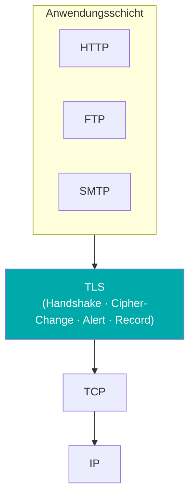
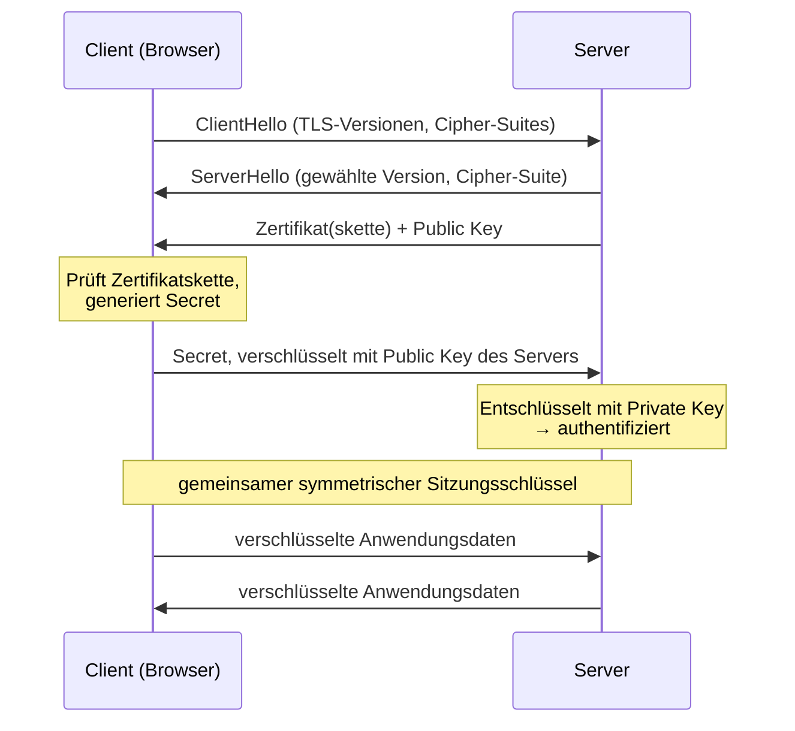
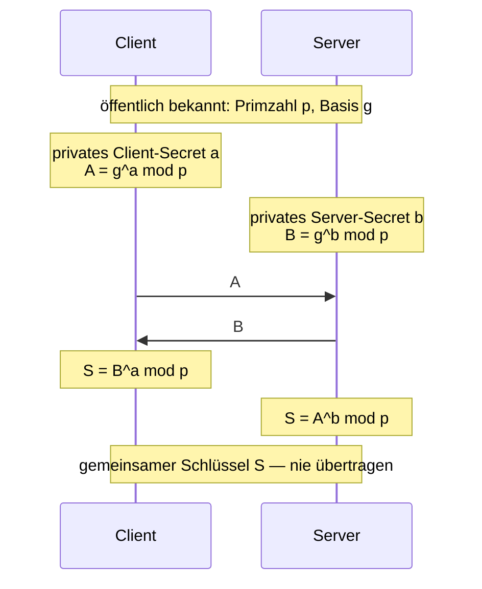
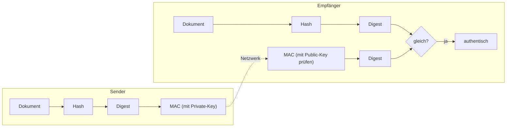
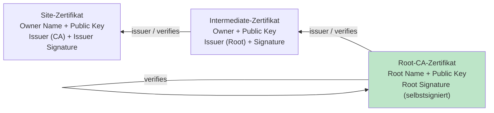
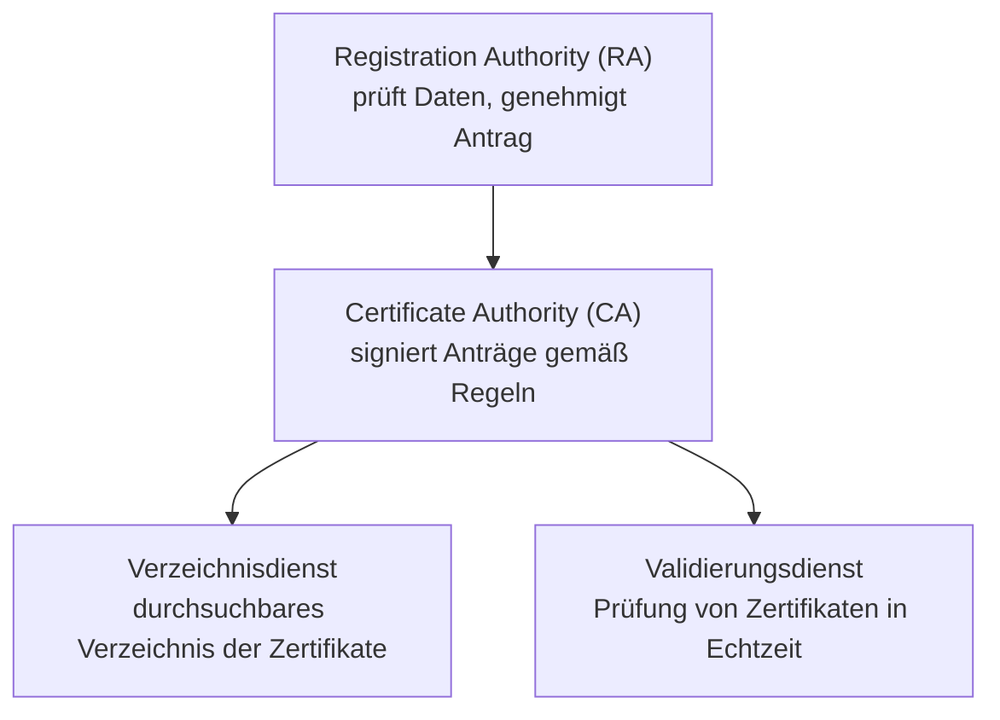
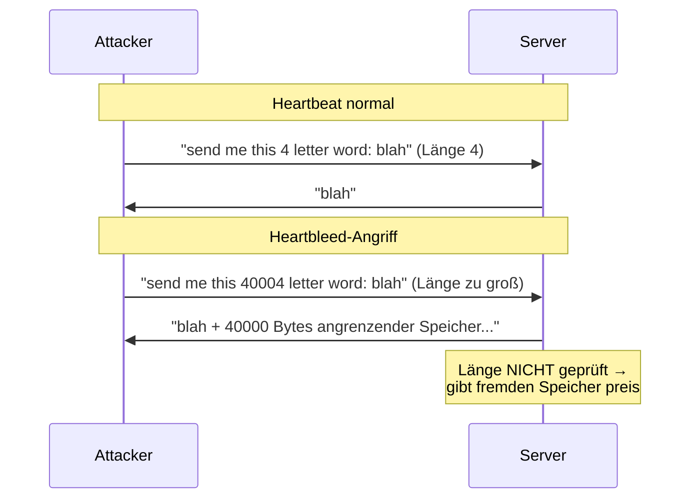
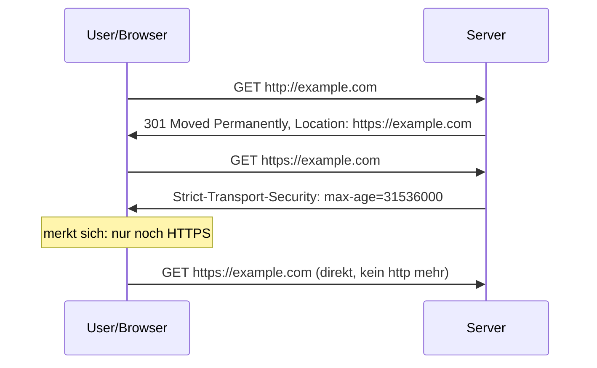
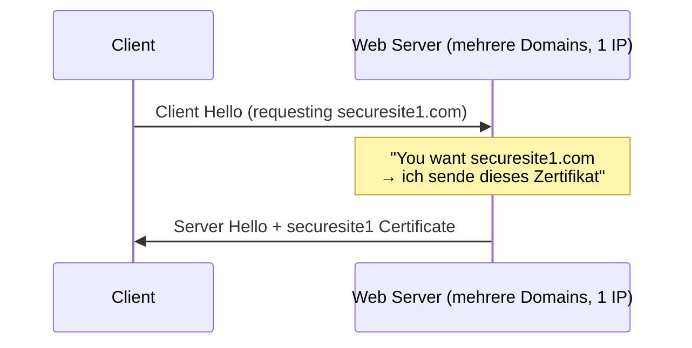
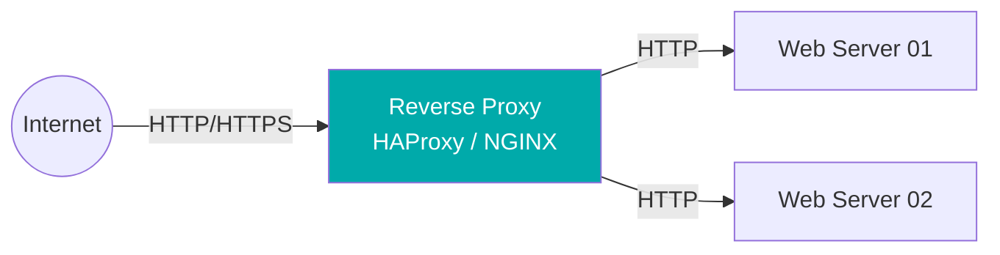

# 16 — HTTPS (TLS, PKI & Zertifikate)

**Folien:** [[web-engineering/resources/16-HTTPS.pdf|16-HTTPS.pdf]]
**Lernziele:** [[web-engineering/lernziele/webeng-lernziele-11|Lernziele Vorlesung 11]]

> [!info] Hinweis
> Woche 11 umfasst zwei Foliensätze — **16 — HTTPS** (diese Notiz) und [[web-engineering/lectures/11/webeng-17-tokens|17 — Tokens (OAuth2 & OpenID Connect)]]. Diese Notiz behandelt die Lernziele zu **TLS / PKI / Zertifikaten**; die Lernziele zu **OAuth2 / OpenID Connect / Bearer-Token** werden in der Tokens-Notiz behandelt.

## Inhaltsverzeichnis

- [[#HTTPS — HTTP Secure|HTTPS — HTTP Secure]]
- [[#TLS in der Protokoll-Schicht|TLS in der Protokoll-Schicht]]
- [[#Symmetrische vs. asymmetrische Verschlüsselung|Symmetrische vs. asymmetrische Verschlüsselung]]
- [[#Der TLS-Handshake|Der TLS-Handshake]]
- [[#Key Share mittels Diffie-Hellman|Key Share mittels Diffie-Hellman]]
- [[#TLS-Versionen und verkürzter Handshake|TLS-Versionen und verkürzter Handshake]]
- [[#Record-Layer und authentisierte Verschlüsselung|Record-Layer und authentisierte Verschlüsselung]]
- [[#HTTP/3 und QUIC|HTTP/3 und QUIC]]
- [[#Signaturen und Hash-Funktionen|Signaturen und Hash-Funktionen]]
- [[#Zertifikate (X.509)|Zertifikate (X.509)]]
- [[#Certificate Authorities und Vertrauensketten|Certificate Authorities und Vertrauensketten]]
- [[#Public Key Infrastructure (PKI)|Public Key Infrastructure (PKI)]]
- [[#Schwächen und Angriffspunkte von TLS|Schwächen und Angriffspunkte von TLS]]
- [[#Buffer Overflow und Heartbleed|Buffer Overflow und Heartbleed]]
- [[#HSTS — HTTP Strict Transport Security|HSTS — HTTP Strict Transport Security]]
- [[#SNI — Server Name Indication|SNI — Server Name Indication]]
- [[#TLS-Terminierung und Proxies|TLS-Terminierung und Proxies]]
- [[#Bezug zu Lernzielen|Bezug zu Lernzielen]]

---

## HTTPS — HTTP Secure

> [!warning] Achtung — HTTP ist unverschlüsselt
> HTTP überträgt **grundsätzlich im Klartext**. Jeder Mittelsmann kann die Kommunikation **mitschneiden und verändern** (**MITM — Man-in-the-Middle-Angriffe**). Um sicherzugehen, dass Inhalte tatsächlich vom Server stammen und **unverändert** ausgeliefert werden, muss **HTTPS** genutzt werden.

> [!quote] Definition (HTTPS)
> **HTTPS** = *HTTP over TLS* / *HTTP over SSL* / *HTTP Secure*. Es baut wie HTTP auf der **Anwendungsschicht** auf, sämtlicher Inhalt (Request und Response) wird **verschlüsselt**. Standardisiert in **RFC 2818** (2000).

- **IP-Adresse und Port** bleiben weiterhin für Mittelsmänner erkennbar — verschlüsselt wird nur der Inhalt, nicht die Vermittlung auf Netzwerkebene.

**TLS / SSL:**

- **TLS (Transport Layer Security)** ist die Weiterentwicklung von **SSL (Secure Socket Layer)** und wird heute fast ausschließlich genutzt.
- Die Begriffe *TLS* und *SSL* werden häufig durcheinandergebracht und oft **synonym** verwendet.

> [!tip] Merke
> HTTPS ändert **nichts** an HTTP selbst — die HTTP-Nachrichten werden lediglich durch eine zusätzliche **TLS-Schicht** geschleust. HTTP bleibt HTTP, nur der Transport ist gesichert.

---

## TLS in der Protokoll-Schicht

TLS ist eine **Schicht zwischen TCP (Transport Layer) und der Anwendungsschicht (Application Layer)** und verschlüsselt die Anwendungsdaten.



TLS selbst besteht intern aus mehreren Teilprotokollen:

| Teilprotokoll | Aufgabe |
|---|---|
| **Handshake Protocol** | Aushandeln von Version, Cipher-Suite, Schlüsseln; Authentifizierung |
| **Cipher Change Protocol** | Umschalten auf die ausgehandelte Verschlüsselung |
| **Alert Protocol** | Fehler- und Warnmeldungen |
| **Record Protocol** | eigentliche Übertragung der (verschlüsselten) Nutzdaten |

---

## Symmetrische vs. asymmetrische Verschlüsselung

TLS kombiniert **beide** Verfahren: asymmetrisch für den **Verbindungsaufbau**, symmetrisch für den **Datentransfer**.

| | Asymmetrisch | Symmetrisch |
|---|---|---|
| **Schlüssel** | Public Key + Private Key (Schlüsselpaar) | ein gemeinsames Secret (Sitzungsschlüssel) |
| **Einsatz in TLS** | Verbindungsaufbau, Authentifizierung, Schlüsselaustausch | eigentliche Datenübertragung |
| **Geschwindigkeit** | langsamer | **schneller** |

**Verbindungsaufbau (asymmetrisch):**

- Benötigt ein **Public Key** und ein **Private Key**.
- Das **Zertifikat** liefert den **Public Key** sowie Meta-Informationen (Servername, Gültigkeitszeitraum, Signaturen anderer Zertifikate).
- Verschlüsselt der Client Daten mit dem **Public Key des Servers**, kann sie nur der **Besitzer des Private Keys** wieder entschlüsseln → der Server authentifiziert sich dadurch.
- Der Client muss aber sicher wissen, dass es sich auch um den **korrekten** Public Key handelt.

> [!warning] Achtung — Vertrauensfrage
> Entscheidend ist, dass die **Zuordnung zwischen Public Key und zugehörigem Subjekt vom Aussteller bestätigt wird** — dadurch wird die zentrale Vertrauensfrage aufgeworfen (→ Zertifikate, CAs, PKI).

**Datenaustausch (symmetrisch):**

- Client und Server einigen sich auf ein **Secret** (Sitzungsschlüssel), mit dem die eigentliche Übertragung verschlüsselt wird — weil **symmetrische Verschlüsselung schneller** ist.

---

## Der TLS-Handshake

> [!example] Beispiel — vereinfachter Handshake mit Server-Authentifikation
> 1. **Client meldet sich beim Server** (ClientHello: unterstützte TLS-Versionen und Cipher-Suites).
> 2. **Server übermittelt sein Zertifikat** inkl. Public Key (und Metadaten wie TLS-Version).
> 3. **Client prüft das Server-Zertifikat** (Public Key) und übermittelt ein Secret:
>    - stellt fest, ob das Zertifikat von einer **vertrauten CA signiert** ist und für die besuchte Webseite ausgestellt wurde (**Zertifikatskette**),
>    - nutzt die Metadaten zur **Auswahl des Verschlüsselungsverfahrens**,
>    - **generiert ein Secret** für die Kommunikation,
>    - verschlüsselt das Secret mit dem übermittelten **Public Key** und sendet es an den Server.
> 4. **Server entschlüsselt das Secret mit seinem Private Key** und ist somit authentifiziert. Nur ein Server, der den Private Key kennt, kann der folgenden Verschlüsselung folgen.
> 5. Beide Seiten besitzen nun das Secret = **symmetrischer Sitzungsschlüssel**; das konkrete Verfahren wurde vereinbart.
> 6. Die Kommunikation wird ab hier **verschlüsselt** fortgeführt.



- Es gibt die Möglichkeit, den Handshake **abzukürzen** und sich auf einen bereits ausgehandelten Sitzungsschlüssel zu beziehen (**Session Resumption**).
- Der Server kann optional auch ein **Client-Zertifikat** anfordern und dieses mit einer **Challenge (Zufallszahl)** validieren (beidseitige Authentifizierung).

> [!warning] Achtung — der Handshake kostet Zeit
> Der Handshake benötigt zusätzliche **Round-Trips** oben auf den TCP-Verbindungsaufbau. Bei TLS 1.2 kommt zum TCP-Handshake (≈ 56 ms) noch der TLS-Handshake (≈ 112 ms) hinzu — spürbare Latenz. Deshalb wird an Verkürzung (Session Resumption, TLS 1.3, QUIC) gearbeitet.

> [!tip] Merke — Zertifikatskette
> Im Handshake wird eine **Zertifikatskette bis zum selbstsignierten (Root-)Zertifikat** übertragen, damit der Client die Vertrauenskette vollständig prüfen kann.

---

## Key Share mittels Diffie-Hellman

Moderne TLS-Versionen tauschen das Secret nicht mehr direkt aus, sondern **berechnen** es beidseitig per **Diffie-Hellman-Schlüsselaustausch** — der Sitzungsschlüssel wird nie über die Leitung geschickt.



- **Öffentlich** sind nur Primzahl `p`, Basis (primitive root) `g` sowie die berechneten Werte `A` und `B`.
- Die **privaten Secrets** `a` (Client) und `b` (Server) verlassen den jeweiligen Rechner **nie**.
- Beide kommen auf denselben **Shared Key** `S`, mit dem HTTP-Request und -Response verschlüsselt werden.
- Bei **Ephemeral** Diffie-Hellman (neue Zufallswerte pro Sitzung) erreicht man **Perfect Forward Secrecy** — ein später kompromittierter Private Key entschlüsselt frühere Sitzungen nicht.

---

## TLS-Versionen und verkürzter Handshake

| | TLS 1.2 (Full Handshake) | TLS 1.3 (Full Handshake) |
|---|---|---|
| **Round-Trips bis Daten** | 2 RTT (Erstverbindung) | **1 RTT** (Erstverbindung) |
| **Key Share** | oft im Verlauf des Handshakes | schon im ersten ClientHello (`Hello, Key Share`) |
| **Effekt** | mehr Latenz | schneller, weniger Nachrichten |

- **Verkürzter Handshake / Session Resumption:** Verweis auf einen früher ausgehandelten Sitzungsschlüssel spart einen kompletten Round-Trip.
- Mit **TLS Fast Open** bzw. TLS 1.3 ist bei Wiederverbindung sogar ein **0-RTT** möglich.

---

## Record-Layer und authentisierte Verschlüsselung

Nach dem Handshake übernimmt das **Record Protocol** die eigentliche Übertragung.

- Anwendungsdaten werden in **Chunks von bis zu 16 KB** zerlegt.
- Jeder Chunk wird verschlüsselt und mit einem **MAC (Message Authentication Code)** signiert; zusammen mit Protokoll-Metadaten ergibt das einen **TLS-Record**, der an den Peer weitergereicht (und in TCP-Segmente von ~1400 Byte verpackt) wird.

**Aufbau eines TLS-Records:**

| Byte | Feld |
|---|---|
| 0 | Content type |
| 1..4 | Version, Length |
| 5..n | Payload |
| n..m | MAC |
| m..p | Padding (nur bei Block-Ciphers) |

> [!quote] Definition (AEAD)
> **AEAD — Authenticated Encryption with Associated Data**: kombiniert **Verschlüsselung** (z.B. `AES-256-GCM`, `CHACHA20`) mit einem **MAC** (z.B. `GMAC`, `POLY1305`). Zusätzliche **Associated Data** (Adressen, Ports, Protokollversion, Sequenznummer) bleiben unverschlüsselt, werden aber **mit-authentisiert** → sichert gleichzeitig **Vertraulichkeit** und **Integrität**.

---

## HTTP/3 und QUIC

**QUIC** ist auf **geringe Latenz** optimiert — so wenige Round-Trips wie möglich.

- Idee: möglichst **alles parallel** machen — Verbindungsaufbau, Sicherung (über TLS) und Applikationsdaten verschicken.
- Bei klassischem `TCP → TLS → App` laufen diese Schritte **nacheinander**; QUIC führt `QUIC + TLS + App` **zusammen**.
- **Kosten:** höhere Komplexität und größere Pakete.

**Vergleich der Handshakes (Zeit bis Datentransfer):**

| Verfahren | Erstverbindung | Wiederverbindung |
|---|---|---|
| TCP + TLS 1.2 | 3 RTT | 2 RTT |
| TCP + TLS 1.3 | 2 RTT | 1 RTT |
| **QUIC** | **1 RTT** | **0 RTT** |

> [!info] Hinweis
> Mit **TCP Fast Open** ist bei Wiederverbindung ebenfalls ein **0-RTT** möglich.

---

## Signaturen und Hash-Funktionen

Signaturen sind die Grundlage von Integrität und Zertifikaten.

- Ein **Dokument beliebiger Größe** wird durch eine **Einweg-Funktion (Hash-Funktion)** auf einen **Message Digest fester Größe** abgebildet.

> [!tip] Merke — Avalanche-Effekt
> Die Änderung eines **einzelnen Bits** im Dokument sollte **ungefähr 50 %** der Hash-Bits verändern. So fällt jede Manipulation sofort auf.

**Einsatz von Signaturen (Integrität + Authentizität):**



- Der Sender hasht das Dokument und **signiert** den Digest mit seinem **Private Key** (→ MAC).
- Der Empfänger hasht das erhaltene Dokument ebenfalls und prüft die Signatur mit dem **Public Key**. Stimmen beide Digests überein, ist das Dokument **authentisch und unverändert**.

---

## Zertifikate (X.509)

Ein **X.509-Zertifikat** bindet einen Public Key an eine Identität und wird vom Aussteller signiert.

**Inhalt eines Zertifikats:**

- Versionsnummer, Seriennummer
- **Signatur-Algorithmus**
- **Aussteller** (die CA, die die Identität validiert hat)
- **Gültigkeit** (Zeitraum)
- **Subject** (die zu prüfende Identität)
- **SubjectPublicKeyInfo** (der öffentliche Schlüssel des Subjekts)
- **Signatur des Ausstellers** — ein mit dem **Private Key des Ausstellers** verschlüsselter Hash des Zertifikatsinhalts (früher z.B. MD5, heute SHA-256)

> [!tip] Merke
> Die Signatur des Ausstellers **bestätigt die Zuordnung des Public Keys zum Subject**. Damit hängt das Vertrauen in ein Zertifikat am Vertrauen in seinen Aussteller.

**Arten von X.509-Zertifikaten:**

| | „Normales" Zertifikat (DV/OV) | Extended-Validation (EV) |
|---|---|---|
| **Garantie** | Echtheit der Webseite (Organization Validated) | Echtheit **und Inhaber** der Webseite |
| **Prüfung** | ggf. recht lose | Identität, Geschäftsadresse, Domain-Eigentum, Unterschriftsberechtigung |
| **Aussage** | nur (technisch): ist die Seite verschlüsselt | zusätzlich: wer betreibt sie rechtlich |
| **Kosten** | ≥ 0 € (z.B. kostenlos über Let's Encrypt) | ≥ 200 € |

> [!warning] Achtung — EV-Zertifikate „sind tot"
> Google und Mozilla haben die **visuellen EV-Signale** (Firmenname in der Adressleiste) aus Chrome/Firefox entfernt. Studien der Chrome-Security-UX zeigten: Nutzer treffen bei fehlendem/verändertem EV-UI **keine sichereren Entscheidungen** — der Schutz durch EV war praktisch wirkungslos. Es kommt letztlich auf den **menschlichen Faktor** an; EV-Zertifikate mit kollidierenden Firmennamen lassen sich zudem durch Wahl einer anderen Jurisdiktion erzeugen.

---

## Certificate Authorities und Vertrauensketten

> [!quote] Definition (Certificate Authority)
> Eine **CA (Certificate Authority / Zertifizierungsstelle)** ist eine vertrauenswürdige Organisation, die Zertifikate ausstellt und **signiert**. Vertraut der Client der CA, so vertraut er auch dem von ihr ausgestellten Zertifikat.

- Browser und Betriebssysteme kommen mit einer Reihe **voreingestellter „Trusted Root CAs"** (Trust Store).
- **Trusted Root CA:** kann Zertifikate für weitere CAs ausstellen (z.B. GeoTrust CA → Google CA), ist **selbstsigniert** und muss ein langes Verfahren durchlaufen, bis Browser/OS sie aufnehmen.
- **Trusted CA (Intermediate):** kann beliebige Zertifikate ausstellen, muss i.d.R. ebenfalls ein längeres Verfahren durchlaufen.
- Die Anzahl vorinstallierter CAs ist in **Betriebssystemen und Browsern unterschiedlich** und variiert sogar je Version.

**Vertrauenskette (Chain of Trust):**



- Jedes Zertifikat wird durch das **übergeordnete** verifiziert; das **Root-Zertifikat verifiziert sich selbst** (selbstsigniert) und liegt im Trust Store.
- Liefert eine Webseite ein Zertifikat einer **nicht aufgelisteten CA**, warnt der Browser („This Connection is Untrusted").

> [!warning] Achtung — Ausnahmen sind lokal
> Bestätigt man eine Zertifikats-Ausnahme „permanent", heißt das **nur**, dass für **dieses eine Zertifikat dieser Webseite** nicht erneut nachgefragt wird. Die **Root-CA selbst wird nicht** in den generellen Trust Store aufgenommen.

> [!example] Beispiel — DigiNotar (2011)
> Ein einziger kompromittierter CA gefährdet das **gesamte Web**. Bei **DigiNotar** kamen Angreifer in Besitz des **Private Keys der CA** und stellten Zertifikate für über **500 Domains** (u.a. google.com) aus, um iranische Bürger abzuhören. Über 300.000 Seiten nutzten das gefälschte Google-Zertifikat (99 % im Iran). Weiteres Beispiel: **Stuxnet (2010)** wurde mit **gestohlenen, gültigen Code-Signing-Zertifikaten** (Realtek, JMicron) signiert — die Angreifer hatten den privaten Schlüssel und konnten Treiber wie legitime Herstellersoftware signieren.

**Maßnahmen gegen CA-Missbrauch:**

- **Certificate Transparency (CT):** öffentliche, in **RFC 9162** standardisierte Logs aller ausgestellten Zertifikate → Fehl-Ausstellungen werden schneller entdeckt (Antwort auf DigiNotar).
- **CAA-DNS-Records:** der Domaininhaber legt fest, **welche CAs** überhaupt Zertifikate für seine Domain ausstellen dürfen.
- **Sanktionierung** von CAs bei Verstößen (bis hin zum Distrust), strengere **Branchenregeln und Audits** (WebTrust/ETSI, CA/B-Forum), bessere Nachweisführung.
- Früheres **HPKP (HTTP Public Key Pinning)** speicherte einen Zertifikats-Hash im Browser — barg aber eigene Risiken (konnte für Attacken genutzt werden) und wird von den meisten Browsern **nicht mehr unterstützt**.

---

## Public Key Infrastructure (PKI)

> [!quote] Definition (PKI)
> Eine **PKI (Public Key Infrastructure)** ist das organisatorische und technische Gerüst, das öffentliche Schlüssel verlässlich an Identitäten bindet — inklusive Ausstellung, Verteilung, Pflege und **Sperrung** von Zertifikaten.

**Motivation — der Einsatz von Zertifikaten erfordert:**

- Wissen um die **Prozesse zur Erstellung** von Zertifikaten (Wie wird die Identität sichergestellt? Wer führt das durch?).
- Pflege von **Zertifikatssperrlisten (Certificate Revocation Lists, CRL)**: Zertifikate können ihren Zweck verlieren (z.B. bei Verlust des Private Keys) → Listen mit zurückgezogenen, abgelaufenen und für ungültig erklärten Zertifikaten.
- Eine Organisation, die einen PKI-Dienst anbietet, heißt **Trust-Center**. Gesetzliche Basis u.a. Signaturgesetz (SigG) 2000, Signaturverordnung.

**Bestandteile einer PKI:**



| Bestandteil | Aufgabe |
|---|---|
| **Registrierungsstelle (RA)** | Stelle, bei der Personen/Maschinen/untergeordnete CAs Zertifikate beantragen; prüft die Richtigkeit der Daten und genehmigt den Antrag |
| **Zertifizierungsstelle (CA)** | signiert genehmigte Anträge gemäß bekannter Regeln |
| **Verzeichnisdienst** | durchsuchbares Verzeichnis ausgestellter Zertifikate |
| **Validierungsdienst** | ermöglicht die Überprüfung von Zertifikaten in Echtzeit (z.B. OCSP) |

> [!warning] Achtung — historische Schwächen
> Früher war es teils **einfach, betrügerische Zertifikate zu erhalten** (z.B. VeriSign 2001: zwei Code-Signing-Zertifikate auf „Microsoft Corporation" an einen Betrüger; keine Online-Prüfung auf Namenskonflikte). Genau solche Vorfälle motivieren RA/CA-Trennung, Audits und Certificate Transparency.

---

## Schwächen und Angriffspunkte von TLS

TLS ist stark, aber die **Umgebung** ist angreifbar:

- **Zufallszahlengenerator:** Rechner haben nur einen **Pseudozufallszahlengenerator**; ist die **Entropie** zu gering, werden Schlüssel vorhersagbar. Von **2004 bis 2013** hatte eine Standardbibliothek zur Erzeugung von Zufallszahlen sogar eine **NSA-Backdoor**.
- **Downgrade-/Protokollangriffe** (siehe POODLE unter HSTS).
- **Schwache oder veraltete Cipher-Suites**.
- **Implementierungsfehler** wie Heartbleed (siehe unten).
- **DNS-Spoofing / Cache Poisoning:** ein Angreifer schleust dem Caching-Resolver eine falsche DNS-Antwort unter (z.B. `6.7.8.9` statt `1.2.3.4`) und lenkt den Client auf einen bösartigen Server.
- **Kompromittierte CAs** und **mangelhafte Zertifikatsprüfung** auf Clientseite.

---

## Buffer Overflow und Heartbleed

> [!quote] Definition (Buffer Overflow)
> Ein **Buffer Overflow** entsteht durch **unzureichende Längenprüfung**: über die Grenzen eines Puffers hinaus wird geschrieben oder gelesen. Ursachen: nachlässige Programmierung und unsichere Programmiersprachen (meist **C**).

**Angriffstechnik (klassischer Overflow):**

- Durch Eingabedaten mit **Überlänge** werden Teile des **Stacks** (lokale Variablen, Parameter) überschrieben.
- Überschreiben der echten **Rücksprungadresse**.
- Platzieren von eigenem **Assemblercode** auf dem Stack **oder** einer gefälschten Rücksprungadresse mit Aufruf einer Bibliotheksprozedur (`LoadLibrary`, Shell, …).

```c
cmd = lies_aus_netz();
do_something(cmd);
// ...
int do_something(char* InputString) {
    char buffer[4];
    strcpy(buffer, InputString); // strcpy kopiert OHNE Prüfung bis NULL gelesen wird!
    return 0;
}
```

> [!warning] Achtung
> `strcpy` kopiert **ohne Prüfung** so lange in den Speicher, bis ein `NULL`-Byte gelesen wird. Ist `InputString` länger als `buffer[4]`, wird angrenzender Speicher überschrieben — der Klassiker für einen Buffer Overflow.

**Heartbleed (Buffer-Over-Read in OpenSSL):**



- Beim normalen **Heartbeat** sendet der Client eine Payload plus deren **Längenangabe**; der Server schickt genau diese Bytes zurück.
- Bei **Heartbleed** gab der Client eine **Länge an, die größer war als die tatsächlich gesendeten Daten**. Der Server kopierte blind so viele Bytes zurück und gab dadurch **angrenzenden Speicher** preis — darunter private Schlüssel, Sessions und Passwörter.
- **Ursache:** fehlende **Längenvalidierung** des Payloads durch den Server (ein Buffer-Over-Read).

> [!tip] Merke
> Sowohl klassischer Buffer Overflow als auch Heartbleed haben **dieselbe Wurzel**: **fehlende Längenprüfung** von Eingabedaten. „Never trust the input."

---

## HSTS — HTTP Strict Transport Security

> [!warning] Achtung — Problem: Downgrade per Redirect
> Das **Ausschalten oder Downgrading** der TLS-Verschlüsselung ist per Redirect möglich. Bei der **POODLE-Attacke** (*Padding Oracle On Downgraded Legacy Encryption*, 2014) konnte per „Downgrade Dance" die Verbindung auf **SSL 3.0** (pre TLS) reduziert werden; ein MITM erhielt so Klartext zur Kommunikation mit dem echten Server (**SSL-Stripping**).

> [!quote] Definition (HSTS)
> **HSTS (HTTP Strict Transport Security)** ist ein Response-Header (`Strict-Transport-Security`), der dem Browser vorschreibt, eine Domain für eine bestimmte Dauer (**`max-age`**) **nur noch über HTTPS** anzusprechen. Künftige HTTP-Anfragen werden automatisch zu HTTPS umgeleitet — **ohne Zwischenschritte und ohne Spielraum für Angriffe**.



**In Express (Node.js):**

```js
const hsts = require('hsts');
app.use(hsts({ maxAge: 15552000 })); // 180 Tage in Sekunden
// → Strict-Transport-Security: max-age=15552000; includeSubDomains
```

> [!success] Best Practice — Helmet
> **Helmet** ist eine Sammlung von neun kleineren Middleware-Angeboten, über die sicherheitsrelevante HTTP-Header (u.a. HSTS) gesetzt werden:
> ```js
> const helmet = require('helmet');
> const sixtyDaysInSeconds = 5184000;
> app.use(helmet.hsts({ maxAge: sixtyDaysInSeconds }));
> // → Strict-Transport-Security: max-age=5184000; includeSubDomains
> ```

---

## SNI — Server Name Indication

> [!quote] Definition (SNI)
> **SNI (Server Name Indication)** ist eine TLS-Erweiterung, bei der der Client den **gewünschten Hostnamen bereits im ClientHello** des Handshakes mitsendet — damit ein Server mit **mehreren Zertifikaten/Domains auf einer IP** (Virtual Hosting) das **passende Zertifikat** ausliefern kann.

**Problem ohne SNI:** Beim Standard-TLS-Handshake sendet der Client nur `Client Hello`, bevor der Server sein Zertifikat schicken muss. Hostet ein Server mehrere HTTPS-Domains (securesite1/2/3.com) auf **einer IP**, weiß er nicht, **welches Zertifikat** er senden soll.

**Lösung mit SNI:** Der Client teilt schon im `Client Hello` mit, dass er z.B. `securesite1.com` möchte — der Server antwortet mit dem **securesite1-Zertifikat**.



---

## TLS-Terminierung und Proxies

> [!quote] Definition (TLS-Terminierung)
> **TLS-Terminierung** bedeutet, dass die verschlüsselte Verbindung an einem **vorgelagerten Punkt** (Reverse Proxy / Load Balancer, z.B. NGINX, HAProxy) **entschlüsselt** wird. Dahinter läuft der Verkehr oft **unverschlüsselt (HTTP)** im internen Netz weiter.



- Vorteile: zentrale Zertifikatsverwaltung, TLS-Rechenlast am Proxy gebündelt, einfaches Load Balancing auf mehrere Backend-Server.
- **TLS Early Termination:** ein geografisch naher **Edge-Proxy** terminiert HTTPS früh (z.B. New York / Tokio), spricht dann per HTTPS mit den entfernten Origin-Servern (London) — verkürzt den langen Handshake-Weg für den Client.

**Weitere Proxy-Formen:**

- **Forward Proxy** (Basis: HTTP-Header `CONNECT`): der Proxy leitet die Handshake-Nachrichten nur **durch**. Bei **Ephemeral Key Exchange** fließen die zur Schlüsselableitung nötigen privaten Informationen nicht über den Proxy — er kann den Session Key **nicht** ermitteln. End-to-End-Verschlüsselung **verbirgt** damit ggf. auch bösartige Aktivitäten vor einer Unified Threat Defense (UTD).
- **TLS/SSL-Proxy (Visibility Appliance):** um doch hineinschauen zu können, agiert der Proxy als **MITM** — er terminiert TLS vom Client (Key1) und öffnet eine zweite TLS-Verbindung zum Server (Key2), entschlüsselt/prüft dazwischen und verschlüsselt wieder. Dazu **generiert und signiert der Proxy dynamisch ein Proxy-Zertifikat**; die **CA des Proxys muss im Trust Store des Clients** liegen, sonst warnt der Browser.

---

## Bezug zu Lernzielen

Die kompakten Karteikarten finden sich unter [[web-engineering/lernziele/webeng-lernziele-11|Lernziele Vorlesung 11]]. Diese Notiz deckt die Lernziele zu **TLS, Zertifikaten und PKI** ab (die ersten sechs Fragen); die Lernziele zu **OAuth2 / OpenID Connect / Bearer-Token** werden in [[web-engineering/lectures/11/webeng-17-tokens|17 — Tokens]] behandelt.

**Wie funktioniert TLS und welchen Zweck erfüllt es?**

TLS (Transport Layer Security, Nachfolger von SSL) sichert die Verbindung zwischen Client und Server und verfolgt drei Ziele: **Vertraulichkeit** (Verschlüsselung), **Integrität** (MAC) und **Authentizität** (Server-, optional Client-Zertifikat). Es liegt als eigene Schicht **zwischen TCP und der Anwendungsschicht**. Ablauf: Im **Handshake** einigen sich beide auf Version und Cipher-Suite (ClientHello/ServerHello), der Server weist sich per **Zertifikat** aus; per **asymmetrischer Kryptografie** bzw. **Diffie-Hellman** wird ein gemeinsamer **symmetrischer Sitzungsschlüssel** vereinbart, ohne dass dieser die Leitung verlässt. Die Nutzdaten werden anschließend **symmetrisch** (schneller) im Record-Layer verschlüsselt und per **MAC/AEAD** gegen Manipulation gesichert. Der Handshake ist verkürzbar (Session Resumption, TLS 1.3, QUIC → weniger Round-Trips).

**Was ist eine Zertifikatskette und wie wird sie geprüft?**

Eine **Vertrauenskette** vom **Server-/Site-Zertifikat** über ein oder mehrere **Intermediate-CA-Zertifikate** bis zum **Root-CA-Zertifikat**. Jedes Zertifikat ist von der jeweils übergeordneten CA **signiert** (Issuer + Issuer Signature); das Root-Zertifikat ist **selbstsigniert** und liegt im **Trust Store** von Browser/OS. Im Handshake wird die Kette bis zum selbstsignierten Zertifikat übertragen. Der Client prüft jede Signatur bis zu einer vertrauenswürdigen Root und kontrolliert zusätzlich **Gültigkeitszeitraum**, **Hostname/CN/SAN** (passt das Zertifikat zur besuchten Seite?) und **Sperrstatus** (CRL/OCSP). Nur eine vollständig prüfbare Kette gilt als vertrauenswürdig; sonst warnt der Browser („Untrusted Connection").

**Was ist TLS-Terminierung und wie ordnet sich TLS in HTTP ein?**

**TLS-Terminierung** heißt, dass die verschlüsselte Verbindung an einem **vorgelagerten Punkt** (Reverse Proxy / Load Balancer wie NGINX oder HAProxy) **entschlüsselt** wird; dahinter läuft der Verkehr oft **unverschlüsselt** im internen Netz. Das bündelt Zertifikatsverwaltung und TLS-Rechenlast und ermöglicht Load Balancing; per Edge-Proxy (TLS Early Termination) verkürzt es zudem den Handshake-Weg. Einordnung: TLS sitzt **zwischen Transport- (TCP) und Anwendungsschicht** — **HTTPS = HTTP über TLS**. HTTP selbst bleibt **unverändert**, die Nachrichten werden nur durch die TLS-Schicht geschleust; IP und Port bleiben für Mittelsmänner sichtbar.

**Warum braucht man eine PKI und welche Schwächen hat TLS?**

Eine **PKI (Public Key Infrastructure)** bindet öffentliche Schlüssel verlässlich an Identitäten — über **CAs** (Signatur von Anträgen), eine **RA** (Prüfung/Genehmigung), einen **Verzeichnisdienst**, einen **Validierungsdienst** und die **Sperrung** via CRL/OCSP. Ohne PKI ließe sich ein öffentlicher Schlüssel nicht vertrauenswürdig einer Gegenstelle zuordnen (Tür für MITM). **Schwächen von TLS:** kompromittierte oder bösartige **CAs** (z.B. DigiNotar 2011, gestohlene Code-Signing-Zertifikate bei Stuxnet), **Downgrade-/Protokollangriffe** (POODLE), schwache/veraltete **Cipher-Suites**, schlechte **Zufallszahlengeneratoren** (zu wenig Entropie, NSA-Backdoor 2004–2013), **DNS-Spoofing**, **Implementierungsfehler** (Heartbleed) und mangelhafte **Zertifikatsprüfung** auf Clientseite. Gegenmaßnahmen: Certificate Transparency (RFC 9162), CAA-Records, Audits, CA-Distrust.

**Was ist die Buffer-Overflow-Problematik — erklärt am Beispiel von Heartbleed?**

Ein **Buffer Overflow** entsteht, wenn über die Grenzen eines Puffers hinaus geschrieben/gelesen wird, weil **Längenangaben nicht geprüft** werden — typisch in C (z.B. `strcpy`, das ohne Prüfung bis zum NULL-Byte kopiert). Klassisch überschreibt man damit den Stack inkl. **Rücksprungadresse** und schleust eigenen Code ein. **Heartbleed** (OpenSSL) war ein **Buffer-Over-Read** in der Heartbeat-Erweiterung: Der Client gab eine Payload-**Länge** an, die größer war als die tatsächlich gesendeten Daten (z.B. „send me this 40004 letter word" bei nur 4 Byte Daten); der Server kopierte blind so viele Bytes zurück und gab dadurch **angrenzenden Speicher** preis — darunter private Schlüssel, Sessions und Passwörter. **Ursache in beiden Fällen: fehlende Längenvalidierung.**

**Welche Bedeutung haben HSTS und SNI?**

**HSTS (HTTP Strict Transport Security)** ist ein Response-Header (`Strict-Transport-Security`, mit `max-age`), der dem Browser vorschreibt, eine Domain **nur noch über HTTPS** anzusprechen — künftige HTTP-Anfragen werden automatisch umgeleitet. Das schützt vor **SSL-Stripping/Downgrade** (z.B. POODLE) und Klartext-Erstaufrufen. In Node.js z.B. über die `hsts`- oder `helmet`-Middleware gesetzt. **SNI (Server Name Indication)** ist eine TLS-Erweiterung, bei der der Client den **gewünschten Hostnamen schon im ClientHello** mitsendet, damit ein Server mit **mehreren Zertifikaten/Domains auf einer IP** (Virtual Hosting) das passende Zertifikat ausliefern kann.
